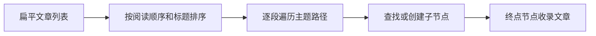

# 知识文章的主题归类与阅读顺序

将文章元数据按主题路径组织成可供知识库导航使用的树，同时提供主题前缀匹配和稳定的文章排序规则；其输入类型来自知识 API 的 ArticleMeta 合同。

来源：gpt-5.6-sol 分析，gpt-5.6-sol 独立复核；模型解释仍可被原始证据纠正。

## 解决导航中的归类与排序问题

知识库页面拿到的是扁平文章列表，而读者需要按“领域—子主题”逐层浏览。本模块提供三个基础能力：判断文章是否属于某个主题路径、按阅读顺序排列文章，以及把列表转换成主题树。主题匹配采用**路径前缀**逐段比较，因此文章位于更深层主题时也会匹配其祖先主题；空路径则会匹配所有文章。排序优先使用 `reading.order`，未配置时视为末尾，同序再按标题比较。参考 [主题匹配与文章排序 ↗](../../../apps/web/src/knowledge/topics.ts#L1 "支持主题采用路径前缀匹配，以及阅读顺序缺失时后置、同序按标题比较的说明。")

## 从文章列表构建主题树

构建过程先创建标题为“知识库”的根节点，并记录输入文章总数；随后复制并排序文章，避免直接改变调用方数组。每篇文章沿 `topicPath` 逐层查找子节点，缺失时即时创建，并在经过的每一层累加文章数量；最终只把文章放入路径终点节点。没有主题路径的文章会直接留在根节点。

这使 `count` 表示某主题及其后代包含的文章数，而 `articles` 仅表示直接落在该节点的文章。参考 [主题树构建流程 ↗](../../../apps/web/src/knowledge/topics.ts#L5 "支持根节点初始化、逐层创建主题、累计数量及在终点节点收录文章的流程和边界说明。")

## 数据合同与可见边界

本模块不获取文章，也不解析正文，只消费知识 API 层定义的 `ArticleMeta`。它依赖其中的 `title`、可选 `topicPath` 和可选 `reading.order`；其他修订、模型、审核等字段不会参与建树。参考 [文章元数据合同 ↗](../../../apps/web/src/knowledge/api.ts#L1 "说明主题模块所消费的 ArticleMeta 来自知识 API 层，并确认 topicPath 与 reading 字段为可选数据。")

需要注意，子主题没有单独执行排序：其展示先后取决于已排序文章首次经过各主题的顺序。当前材料也没有调用方或测试文件，因此无法确认界面是否依赖这一隐式顺序，以及重复主题名、空主题段等输入是否会在上游被校验。参考 [主题树构建流程 ↗](../../../apps/web/src/knowledge/topics.ts#L5 "支持根节点初始化、逐层创建主题、累计数量及在终点节点收录文章的流程和边界说明。")
