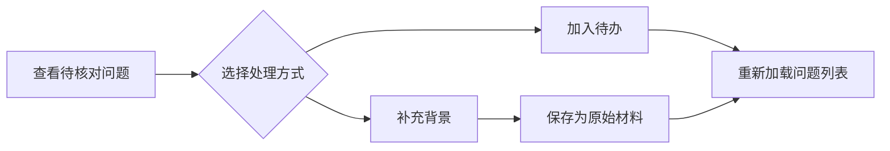

# 待核对问题的补充与调查入口

该组件集中展示知识生成中尚未确定的问题，并提供“补充背景”和“加入待办”两条处理路径。操作完成后会重新加载列表；加载异常虽会被记录，但初始列表为空时不会显示在当前界面中。

来源：gpt-5.6-sol 分析，gpt-5.6-sol 独立复核；模型解释仍可被原始证据纠正。

## 把知识缺口变成可处理事项

组件用于承接材料中暂时无法确认的事项，让读者看到问题、产生原因及建议的下一步，而不是把不确定内容混入知识正文。它可以限定为当前文档的问题，并统一排除已被替代的记录。参考 [问题加载与筛选 ↗](../../../apps/web/src/knowledge/KnowledgeQuestions.vue#L5 "支持按文档与状态筛选问题、首次挂载加载数据，以及加载异常写入消息状态的说明。")

页面用徽标区分“已补充背景”“已加入待办”“需要判断”和一般后续调查，只有状态仍为 `open` 的问题提供操作入口。没有可见问题时，整个折叠区域都不会渲染。参考 [问题展示与操作条件 ↗](../../../apps/web/src/knowledge/KnowledgeQuestions.vue#L18 "支持无可见问题时隐藏整个区域、状态徽标映射、开放问题操作入口及状态消息所在位置的说明。")

## 补充背景与加入待办的流程

选择“补充背景”后，组件展开必填文本框，将内容提交到该问题的回答端点；成功后清空编辑状态并重新加载列表。选择“加入待办”则调用任务端点，成功后也会刷新列表。界面明确提示回答被保存为原始材料，相关知识仍等待重新核对，因此前端不会直接用回答改写正文。参考 [回答与待办处理 ↗](../../../apps/web/src/knowledge/KnowledgeQuestions.vue#L11 "支持回答保存、加入待办、成功后重新加载，以及回答仍需后续知识核对的流程说明。")

## 请求封装与界面边界

组件通过共享的 `knowledgeApi` 请求后端。该封装拼接前缀与路径，在存在请求体时设置 JSON 内容类型，从会话存储附加令牌，并把失败响应转换为可读错误；业务状态迁移仍由服务端决定。参考 [统一知识请求封装 ↗](../../../apps/web/src/knowledge/api.ts#L6 "说明组件依赖的请求封装如何设置请求头、附加会话令牌、处理失败响应并解析结果。")

组件在首次挂载及操作成功后加载问题。首次加载失败时，异常文字会写入 `message`，但问题数组仍为空，而状态消息位于受 `visible.length` 控制的折叠区域内，因此当前模板不会把这次错误显示出来。`documentKey` 变化会影响本地筛选结果；材料中没有监听 `prefix` 并主动重新请求的逻辑。参考 [问题加载与筛选 ↗](../../../apps/web/src/knowledge/KnowledgeQuestions.vue#L5 "支持按文档与状态筛选问题、首次挂载加载数据，以及加载异常写入消息状态的说明。")、[问题展示与操作条件 ↗](../../../apps/web/src/knowledge/KnowledgeQuestions.vue#L18 "支持无可见问题时隐藏整个区域、状态徽标映射、开放问题操作入口及状态消息所在位置的说明。")
