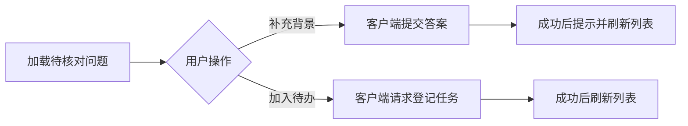

# 知识疑问的补充与待办跟进

该组件在知识阅读现场展示尚未确认的问题，并提供“补充背景”和“加入待办”两种操作。前端提交答案后会提示其已作为原始材料保存并等待重新核对，但现有材料不足以验证服务端实际持久化与重核对行为。

来源：gpt-5.6-sol 分析，gpt-5.6-sol 独立复核；模型解释仍可被原始证据纠正。

## 把不确定事项留在阅读现场

组件用于承接知识文章中仍缺少依据的问题：挂载时从知识接口加载列表，可按当前 `documentKey` 筛选，并排除已被取代的事项。读者因此能在阅读结论的同时看到尚待补充的背景、疑问原因和建议的调查步骤。参考 [问题加载与筛选 ↗](../../../apps/web/src/knowledge/KnowledgeQuestions.vue#L5 "支持组件按文档筛选问题、排除已取代事项并在挂载时加载列表的说明。")

界面以折叠区域呈现这些事项，并用徽标区分已补充背景、已加入待办、需要判断和后续调查。**“补充背景”和“加入待办”按钮只对 `open` 状态显示**；问题转为其他状态后，列表内容仍可保留用于说明处理结果。参考 [问题展示与操作条件 ↗](../../../apps/web/src/knowledge/KnowledgeQuestions.vue#L18 "支持状态徽标、问题详情、开放状态按钮条件及回答表单显示条件的说明。")

## 补充背景与登记待办

选择“补充背景”会打开必填文本框，提交时由客户端向回答端点发送答案。请求成功后，组件显示“回答已作为原始材料保存，相关知识等待重新核对”的提示，清空输入与当前编辑状态并重新加载列表；这只能证明前端请求和反馈流程，不能单凭该组件确认服务端已经完成原始材料持久化或知识重核对。另一条路径会向任务端点发起请求，成功后提示已加入待办并刷新列表。参考 [回答与待办请求 ↗](../../../apps/web/src/knowledge/KnowledgeQuestions.vue#L11 "支持客户端提交答案或任务请求、更新提示、清理编辑状态和重新加载列表的流程。")

参考 [回答与待办请求 ↗](../../../apps/web/src/knowledge/KnowledgeQuestions.vue#L11 "支持客户端提交答案或任务请求、更新提示、清理编辑状态和重新加载列表的流程。")

## 请求边界与交互限制

组件通过统一的 `knowledgeApi` 发起请求。该封装从会话存储读取令牌，在有请求体时设置 JSON 内容类型，合并调用方请求头，并在非成功响应时优先抛出服务端返回的错误；组件再把加载或操作异常显示为状态消息。参考 [知识请求封装 ↗](../../../apps/web/src/knowledge/api.ts#L6 "支持认证头、JSON 请求头、错误转换和响应解析等统一请求行为。")

当前交互状态较轻量：所有问题共用一份答案和消息，且没有提交中状态或防重复提交。还有一个状态残留边界：操作按钮受 `open` 限制，但回答表单只检查当前 `active` ID；若用户先打开表单，再把同一问题加入待办，刷新后该非开放问题仍可能继续显示表单。参考 [问题展示与操作条件 ↗](../../../apps/web/src/knowledge/KnowledgeQuestions.vue#L18 "支持状态徽标、问题详情、开放状态按钮条件及回答表单显示条件的说明。")、[回答与待办请求 ↗](../../../apps/web/src/knowledge/KnowledgeQuestions.vue#L11 "支持客户端提交答案或任务请求、更新提示、清理编辑状态和重新加载列表的流程。")
