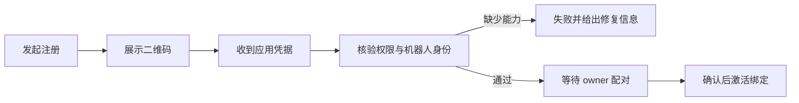

# 飞书应用接入与安全绑定验收

该测试以临时 SQLite、真实接入服务和加密凭据仓库为核心，配合可控的注册与能力探测替身，验证飞书应用从扫码注册、能力核验、配对绑定到版本切换的主要契约，并覆盖取消、过期、权限缺失、秘密泄漏及旧应用导入等风险。它属于进程内验收测试，不等同于真实飞书环境的端到端验证。

来源：gpt-5.6-sol 分析，gpt-5.6-sol 独立复核；模型解释仍可被原始证据纠正。

## 解决什么问题

这组验收测试确保“接入一个飞书机器人”不是拿到凭据就立即启用，而是经过注册、能力检查和 owner 配对后才形成有效连接。每个用例创建临时 `Store`、加密秘密仓库以及真实 `LarkOnboardingService`，仅把外部注册和探测替换为可控实现；辅助函数 `ready` 串起启动、返回凭据和等待状态收敛。参考 [验收环境与主流程辅助函数 ↗](../../../apps/server/tests/lark-onboarding.test.ts#L111 "支持测试使用临时数据库、加密仓库、真实接入服务并由辅助函数推进注册流程的说明。")

临时 `Store` 仍会执行正式数据库迁移并初始化应用、任务、输入及运行请求等仓储，因此断言覆盖的是实际 SQLite 表结构与服务持久化交互，而非纯内存模型。参考 [SQLite 存储初始化 ↗](../../../apps/server/src/store.ts#L38 "说明 Store 会执行迁移并初始化实际仓储组件，支撑测试不是纯内存模型的判断。")

## 注册、核验与状态收敛

核心路径可以概括为：

官方适配器的替身测试验证配置被映射到 SDK、二维码元数据可向上返回；HTTP 探测测试则聚合 token、机器人身份和应用配置，并明确把事件订阅留给运行时投递验证。参考 [官方 SDK 配置映射 ↗](../../../apps/server/tests/lark-onboarding.test.ts#L224 "支持注册适配器传递 createOnly、应用预设和能力配置并返回二维码相关结果。")、[应用能力探测 ↗](../../../apps/server/tests/lark-onboarding.test.ts#L176 "支持探测 token、机器人身份、应用权限与回调，并将事件核验标记为运行时完成。")

网络超时或服务端错误由注册请求专用拦截器重试，保留同一轮询请求与 device code；测试确认首次超时后请求体原样再次发送。参考 [同一注册请求重试断言 ↗](../../../apps/server/tests/lark-onboarding.test.ts#L331 "证明瞬时超时后重发的是相同注册轮询请求体。")、[注册重试拦截器 ↗](../../../apps/server/src/integrations/lark/registration.ts#L33 "解释重试仅针对注册路径、可重试传输错误或服务端错误，并受中止信号和次数限制。")。取消、拒绝和过期是终态，取消后的迟到凭据只留下待复核错误，不创建连接或秘密文件；能力缺失则保留失败连接和完整状态轨迹。参考 [取消与拒绝终态 ↗](../../../apps/server/tests/lark-onboarding.test.ts#L372 "支持取消后忽略迟到凭据以及拒绝、过期不创建连接的行为说明。")、[能力缺失状态轨迹 ↗](../../../apps/server/tests/lark-onboarding.test.ts#L407 "证明能力检查失败会记录缺失项、失败连接及从草稿到失败的状态序列。")

## 秘密隔离与配对约束

测试要求 `client_secret` 不出现在状态、连接列表或数据库行中，只以引用进入连接版本；磁盘内容为密文，且可由秘密仓库还原。秘密仓库本身要求 32 字节密钥、限制目录权限，并校验引用格式。参考 [凭据不落明文验收 ↗](../../../apps/server/tests/lark-onboarding.test.ts#L445 "支持秘密不出现在返回对象、数据库和磁盘明文中，并可通过引用解密读取。")、[加密仓库密钥与引用约束 ↗](../../../apps/server/src/integrations/lark/secret-store.ts#L22 "解释秘密仓库的密钥长度、目录权限和引用格式要求。")。POSIX 下还断言文件权限为 `0600`；Windows 分支只能确认文件存在可读，ACL 强度未在此测试中验证。参考 [跨平台秘密文件检查 ↗](../../../apps/server/tests/lark-onboarding.test.ts#L42 "支持 POSIX 权限断言与 Windows 仅检查文件存在可读的边界说明。")

扫码注册返回的用户信息不能代替同应用配对。配对码需具备足够随机长度，并校验有效期、应用、发送者身份和一次性消费；确认错误 owner 或重复确认都会失败。参考 [注册信息不能替代配对 ↗](../../../apps/server/tests/lark-onboarding.test.ts#L476 "证明即使注册结果含用户信息，系统仍保持等待配对且不建立绑定。")、[配对码安全约束 ↗](../../../apps/server/tests/lark-onboarding.test.ts#L488 "支持配对码随机长度、过期、应用与身份匹配以及一次性消费规则。")

## 既有应用更新与覆盖边界

更新既有应用时，新凭据先作为待确认版本保存，旧版本继续活动；owner 完成新配对后，连接与绑定版本才切换，旧版本标记为 superseded，并为新目标建立决策、群监控和通知用途。参考 [连接与绑定版本切换 ↗](../../../apps/server/tests/lark-onboarding.test.ts#L590 "证明更新版本在确认前保持暂存，确认后新版本激活且旧版本被替代。")、[新绑定目标用途 ↗](../../../apps/server/tests/lark-onboarding.test.ts#L651 "支持新版本确认后创建决策、群监控和 owner 通知目标的说明。")。从 Botmux 导入时不会再次调用注册适配器，也不会把导入秘密返回给调用方，但仍必须完成本系统的配对确认。参考 [Botmux 既有应用导入 ↗](../../../apps/server/tests/lark-onboarding.test.ts#L664 "证明导入不会暴露秘密或重新注册，但仍要求完成 owner 配对。")

默认配置的断言同时检查所需文档、日历、会议等权限和事件存在、列表无重复，并排除批量发信、删群及 ACL 删除等高风险能力。参考 [默认能力白名单与排除项 ↗](../../../apps/server/tests/lark-onboarding.test.ts#L252 "支持默认权限、事件覆盖、去重以及高风险能力排除的测试范围。")。不过这些用例使用 SDK、HTTP 和时钟替身，未覆盖真实二维码扫描、WebSocket 事件到达、飞书控制台配置漂移、并发配对或进程崩溃恢复。
