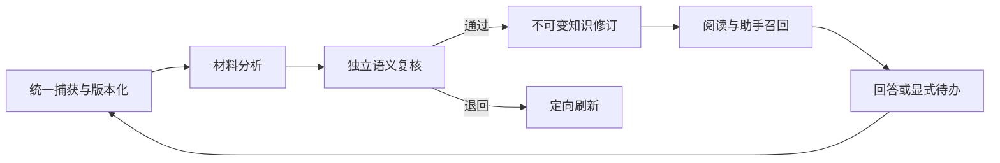

# 从统一捕获到可追溯知识与行动

本章说明 omem 如何把手工、文件、代码、聊天和屏幕事件统一保存为版本化原始材料，再经分析、独立复核和固定引用形成可阅读知识，并将证据用于助手召回、代码理解与事项跟进；同时区分当前已验证能力、历史设计和仍需现场验收的外部集成。

来源：gpt-5.6-sol 分析，gpt-5.6-sol 独立复核；模型解释仍可被原始证据纠正。

## 解决材料、解释与行动相互脱节的问题

omem 面向的不是单纯文档搜索，而是把零散输入变成**能追溯、会更新、可继续行动**的个人知识。手工内容、文件、Git、飞书、Agent、hook、聊天和屏幕观察都进入统一捕获合同；即时材料直接保存，连续事件则按会话或窗口聚合，并保留观察时间、参与者和版本。参考 [统一捕获与事件聚合 ↗](../../../docs/implementation/inputs.md#L3 "支持多来源输入、即时与聚合入口、版本化及观察时间的说明。")

原始事实始终属于 Capture、Source、Revision 与 Fragment。知识正文只是带固定引用的派生解释：来源变化会使相关知识过期，但旧修订和旧引用仍可回读；用户回答则作为新的原始材料加入下一轮核对，而不是改写历史证据。参考 [固定引用与不可变知识 ↗](../../../docs/implementation/knowledge-pipeline.md#L5 "支持原始证据边界、不可变知识修订、来源变化失效及用户回答保存方式。")

## 分析、复核、发布与更新如何协作

处理链路可概括为：

材料、代码、对话和图像共用同一角色运行时与持久任务表；知识任务按种类领取，不会抢占学习或通知工作。KnowledgePipeline 先分析，再由独立会话检查引用是否真正支持论断，来源在处理中变化时拒绝发布。参考 [共用角色运行与发布门槛 ↗](../../../docs/implementation/knowledge-pipeline.md#L15 "支持各类材料共用运行时、任务隔离、独立复核和来源变化时拒绝发布。")

仓库评审只是这条通用流程的输入适配器。通过复核的结果保存为 JSON 和带内联引用的 Markdown；局部生成会调用模型，索引重建则只恢复已有知识。运行数据、旧历史库和派生正文不会被重新冒充为原始证据。参考 [仓库适配与知识产物 ↗](../../../docs/implementation/knowledge-pipeline.md#L31 "支持仓库只是输入适配器、通过结果可移植保存，以及生成和索引重建的职责区别。")

## 代码阅读、证据下钻与事项跟进

代码知识是在统一证据链上增加的可重建投影：固定快照经 TS/Vue 解析形成文件、符号和关系，人工登记边仍来自明确 seed；它不是第二套知识库。当前结构图可用于浏览，但跨文件调用不解析，名称级调用只是候选，跨 revision 的符号与片段身份仍需重新同步定位。参考 [代码知识实测与边界 ↗](../../../docs/implementation/status.md#L48 "支持 Code Wiki 的统一证据链定位、确定性解析现状及跨文件调用和跨版本身份限制。")

个人知识与仓库知识共用 Evidence Trail：正文引用先说明理由，再逐层进入知识章节、固定原文或代码；支持返回、循环跳回、滚动、焦点和深链恢复。助手即使命中派生正文，最终也沿引用返回原始 Fragment，并重新核对当前来源。参考 [共用证据阅读与召回 ↗](../../../docs/implementation/knowledge-pipeline.md#L45 "支持 Evidence Trail 的共享交互合同，以及派生正文只引导召回原始 Fragment。")

证据还可进入日常行动链：本人交办先保存原文，模型提出结构化操作，MemoryService 校验应用并返回真实回执；等待对象、跟进时间和业务截止时间分别保存，完成、取消或稍后都有明确状态语义。参考 [交办与事项状态流程 ↗](../../../docs/implementation/daily-follow-up.md#L3 "支持本人交办、结构化操作、MemoryService 应用、跟进时间和状态变更的工作方式。")

## 当前进展、验证边界与剩余限制

截至 2026-10-01，统一知识阅读、中文向量检索、来源更新后的重核验、日常助手与事项跟进已经形成可运行切片；状态页同时强调全库知识尚未完整，实际完成度必须看当前覆盖与验证报告，不能沿用旧统计。参考 [统一知识能力最新进展 ↗](../../../docs/implementation/status.md#L1 "支持统一阅读、检索、来源更新闭环和全库覆盖仍未完成的当前状态。")

浏览器记录覆盖捕获、递归证据、版本保留、任务跟进、授权页面、三种视口、故障呈现和 Markdown／Mermaid 阅读；后端使用真实 Fastify 与 SQLite，但智能体是确定性 ACP 协议夹具，因此该记录不能证明真实模型或外部服务在同一批场景中通过。参考 [浏览器验收范围 ↗](../../../docs/implementation/browser-verification.json#L2 "支持浏览器场景覆盖、真实后端与确定性 ACP 协议夹具之间的证据边界。")

实现验证还明确保留若干边界：跨文件类型感知调用、真实飞书 WebSocket、外部屏幕观察器和租户隔离没有由该批检查证明；独立模型复核也不等于人工验收。当前架构仍以个人单用户 SQLite 为事实边界。参考 [实现验证剩余限制 ↗](../../../docs/implementation/knowledge-verification.json#L39 "支持跨文件解析、外部集成、租户隔离和模型复核仍存在的验证边界。")
