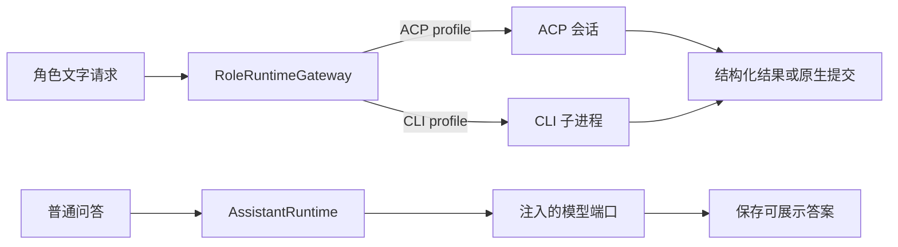

# 一次模型请求如何经过 ACP 或 CLI 返回

以同一条文字请求为例，解释角色运行网关怎样在 ACP 与 CLI 之间分流，模型配置、工具进度、权限、正文和取消分别由哪一层处理，并区分普通问答与必须通过 submit_result 交付的原生知识调查。

来源：gpt-5.6-sol 分析，gpt-5.6-sol 独立复核；模型解释仍可被原始证据纠正。

## 先看一次请求会经过哪些层

假设开发者提交同一句话：“解释这段代码为什么这样工作”。若它是一项**角色任务**，调用方把角色、`AgentProfile`、上下文、取消信号和可选工具交给 `RoleRuntimeGateway.run`。参考 [角色运行输入 ↗](../../../apps/server/src/agent-runtime/gateway.ts#L287 "支持调用方向角色网关传入角色、profile、上下文、取消信号、工具与研究工厂。") 网关随后准备独立工作区、渲染提示，并按 profile 选择 ACP 或 CLI；两条路径的结果最后回到同一套结构化校验。参考 [工作区与传输分流 ↗](../../../apps/server/src/agent-runtime/gateway.ts#L342 "支持网关准备工作区、渲染提示并在 ACP 与 CLI 之间分流，最后统一处理结果。")

若它是 Web/Lark 的**普通问答**，入口则是 `AssistantRuntime`：这一层负责会话上下文、证据检索、受治理操作和答案持久化，模型能力由注入的 `AssistantModelPort` 提供。不能仅凭这份运行时实现断言普通问答一定通过 CLI。参考 [普通问答职责 ↗](../../../apps/server/src/assistant/runtime.ts#L194 "说明 AssistantRuntime 的检索、治理、持久化职责以及模型端口由外部注入。")

网关还把角色规则、内联技能与输出合同放在可信区，把派生知识和原始材料标为不可信数据；材料内容因此只作为待分析的输入。参考 [提示信任分层 ↗](../../../apps/server/src/agent-runtime/gateway.ts#L170 "支持可信角色合同与不可信派生知识、原始材料被分区组装。")

## ACP：建立会话，再协商能力

ACP 路径先用 profile 指定的命令和参数启动子进程，再创建连接所需的输入、输出流并包装成 NDJSON 双向流。参考 [子进程启动 ↗](../../../apps/server/src/agents.ts#L61 "支持传输适配按 profile 的命令和参数在指定工作目录启动子进程。") [ACP 进程入口 ↗](../../../apps/server/src/agents.ts#L90 "支持 ACP 使用 profile 原始参数启动 Agent 子进程。") [NDJSON 双向流 ↗](../../../apps/server/src/agents.ts#L149 "支持 ACP 将子进程标准输入输出包装为双向流并建立 NDJSON 协议流。") 协议初始化完成后，它以当前工作目录、MCP 服务和 native skills 新建 session；若任务声明了必须存在的 skill，运行时会等待 Agent 报告可用命令，发现失败便结束运行。参考 [ACP 会话与技能发现 ↗](../../../apps/server/src/agents.ts#L267 "支持协议初始化、以工作目录和 MCP 服务新建 session，以及原生 skill 发现失败处理。")

模型和推理强度在 session 建立后协商：代码从 Agent 返回的 `configOptions` 中按标识或类别寻找选项，确认请求值受支持后才设置，并把更新后的选项交回网关记录。这是 ACP 与静态命令行参数的重要区别。参考 [动态模型选项 ↗](../../../apps/server/src/agents.ts#L310 "支持 ACP 从 session 配置选项确认并设置模型与推理强度。")

发出 prompt 前还会核对上下文预算与图片能力；prompt 只有以正常回合结束才算完成。参考 [ACP 提示完成 ↗](../../../apps/server/src/agents.ts#L335 "说明上下文预算、图片能力检查、发送 prompt 与正常回合结束要求。")

## CLI：输入一段文本，解析最终消息

CLI 路径更像受约束的批处理适配器。网关拒绝图片，把所有文本块合成一个字符串交给 `cli`；`cli` 再启动子进程并把这段文本写入标准输入。参考 [CLI 文本输入 ↗](../../../apps/server/src/agent-runtime/gateway.ts#L459 "支持网关拒绝 CLI 图片并把所有文本块拼成字符串交给 CLI。") [CLI 标准输入 ↗](../../../apps/server/src/agents.ts#L418 "支持 CLI 启动子进程、接收网关传来的文本并写入标准输入。") Claude 风格 CLI 使用流式 JSON、关闭工具与会话持久化；另一类 CLI 使用只读、临时的 JSON 执行模式。模型与 effort 由静态参数映射，没有 ACP 的 session 能力协商。参考 [CLI 启动参数 ↗](../../../apps/server/src/agents.ts#L386 "支持两类 CLI 的静态模型参数、受限执行方式和无会话持久化配置。")

输出按行解析：Codex 风格的最终 Agent 消息、Claude 风格的 assistant 文本，或尚未产生正文时的 result 字段会变成正文；损坏输出、提供方错误、非零退出或没有正文都会使运行失败。参考 [CLI 正文解析 ↗](../../../apps/server/src/agents.ts#L446 "说明 CLI 从流式 JSON 行提取正文，并处理损坏输出、提供方错误、非零退出与空正文。")

因此，同一个示例在 Traex ACP 中可以显示工具状态并使用 MCP，而当前 CLI 适配只提取约定的文本事件；网关也明确禁止非 ACP profile 承载托管工具。参考 [托管工具边界 ↗](../../../apps/server/src/agent-runtime/gateway.ts#L332 "支持非 ACP profile 不能承载网关托管工具的能力边界。")

## 配置、进度、权限和正文分别在哪里

| 关注点 | ACP | CLI | 统一层 |
| --- | --- | --- | --- |
| 模型配置 | session 建立后按动态选项设置 | `cliArgs` 静态映射参数 | profile 由调用方传给网关 |
| 工具进度 | session update 可转成状态并交给研究环境 | 当前适配器只解析正文事件 | `emit` 把事件转发给上层 |
| 权限 | 仅环境明确允许的单次授权可通过 | 由受限启动参数约束 | 网关接入权限策略 |
| 正文 | 只接收文本型 Agent 消息块 | 从约定 JSON 事件提取文本 | 只有 `text` 被累计为候选输出 |

ACP 会把工具调用、计划和用量更新交给可选回调；首次工具调用还产生可见状态。权限请求只有在存在单次授权选项且环境明确同意时才通过，否则会记录请求、发出权限提示并取消；补充信息请求也不会让后台任务一直等待。参考 [ACP 进度与权限 ↗](../../../apps/server/src/agents.ts#L186 "支持权限显式放行、补充输入拒绝以及工具更新向状态和回调分流。")

网关统一转发事件，却只把 `text` 拼入候选输出，因此状态和权限文案不会混进正文；ACP 返回的最终模型与 effort 则从 session 当前选项取得。参考 [网关事件与配置记录 ↗](../../../apps/server/src/agent-runtime/gateway.ts#L411 "支持网关只累计 text、向 ACP 接入回调，并记录 session 返回的模型和推理强度。")

这里能确认的是 `AgentProfile` 如何被两种传输消费。固定材料没有包含更上游“磁盘配置如何装载成 profile”的代码，本页不推断其具体来源。参考 [角色运行输入 ↗](../../../apps/server/src/agent-runtime/gateway.ts#L287 "支持调用方向角色网关传入角色、profile、上下文、取消信号、工具与研究工厂。")

## 取消会沿运行层向下传播

角色任务的同一个 `AbortSignal` 会从网关传给传输层。ACP 收到取消后先尝试协议级 session cancel，再标记取消并停止子进程；结束时还会等待进程释放工作目录。参考 [ACP 取消 ↗](../../../apps/server/src/agents.ts#L140 "支持 ACP 先尝试协议级取消，再标记失败并停止进程。") [ACP 进程清理 ↗](../../../apps/server/src/agents.ts#L368 "支持 ACP 结束时停止子进程并等待其释放工作目录。") CLI 没有协议会话，只停止子进程并以取消错误结束。参考 [CLI 取消 ↗](../../../apps/server/src/agents.ts#L433 "支持 CLI 通过停止子进程结束运行并以取消错误拒绝。") 网关发现 signal 已取消时会直接抛出，不把它当作结构化输出错误进入修复循环。参考 [取消跳过输出修复 ↗](../../../apps/server/src/agent-runtime/gateway.ts#L533 "支持网关在 signal 已取消时直接抛错，不进入结构化输出修复。")

普通问答还有产品层语义：同一会话的新消息会中止旧回合，并把旧回合标成取消；公开取消入口同时触发控制器和数据库状态更新。参考 [问答回合取消 ↗](../../../apps/server/src/assistant/runtime.ts#L243 "支持同会话新消息中止旧回合，以及公开取消入口同步更新运行和持久状态。") 运行时先召回可见证据和历史，允许模型提出一轮补充检索；最终只保留运行时实际提供过的引用，并在保存答案前再次检查取消。参考 [问答证据与模型调用 ↗](../../../apps/server/src/assistant/runtime.ts#L465 "支持普通问答组装历史和证据、调用注入模型并执行可选的二次检索。") [引用过滤与答案保存 ↗](../../../apps/server/src/assistant/runtime.ts#L604 "支持只保留运行时提供过的引用，并在最终持久化前执行取消栅栏。") 因而普通问答产出的是可展示、可持久化的自然语言回合，而不是知识角色的提交对象。

## 原生知识调查为何必须走 ACP

原生知识调查不是第三种模型传输，而是附加在 ACP 角色运行上的一次性研究环境。网关收到 `research` 工厂后，把相关 skill 切换为 native；若 profile 不是 ACP 会立即拒绝。参考 [原生调查只走 ACP ↗](../../../apps/server/src/agent-runtime/gateway.ts#L307 "支持研究模式绑定 ACP、将 skill 切为 native 并创建研究环境。") 环境把固定材料导出到 `originals/`，生成 `catalog.json` 与 `knowledge.json`，并建立只读数据库快照，供 Agent 按需阅读和检索。参考 [研究快照准备 ↗](../../../apps/server/src/knowledge/agent-research.ts#L90 "支持研究环境导出固定原件和知识目录、创建只读数据库快照并选择检索实现。")

与普通问答拿到一段 answer 不同，调查 Agent 可以在限定工作区内反复读原件、搜索、查看符号和已有文章。研究环境记录工具与计划活动，只自动允许本任务注册的 omem 工具，或位置都处在研究工作区内的读取和搜索。参考 [研究审计与授权 ↗](../../../apps/server/src/knowledge/agent-research.ts#L731 "支持研究环境记录原生工具活动，并只允许本地 omem 工具或工作区内读取搜索。")

正式结果必须调用 `submit_result`。该工具用角色 schema 和宿主验证器检查对象，成功后保存候选；如果 Agent 只在聊天里打印 JSON，网关会判定缺少提交。提交对象仍经过统一角色与领域校验，所以“交回候选”不等于“文章已经发布”。参考 [候选结果提交 ↗](../../../apps/server/src/knowledge/agent-research.ts#L638 "支持 submit_result 使用角色 schema 与宿主验证器校验并保存候选结果。") [网关读取正式提交 ↗](../../../apps/server/src/agent-runtime/gateway.ts#L473 "说明原生研究缺少 submit_result 会失败，提交对象随后仍进入统一输出校验。")

## 接入或修改时从哪里下手

按职责找入口最直接：

- 改进程启动、ACP 连接与事件解析、CLI 参数与正文抽取、权限回调或传输层取消：看 `agents.ts` 的 `acp`、`cliArgs` 与 `cli`。参考 [子进程启动 ↗](../../../apps/server/src/agents.ts#L61 "支持传输适配按 profile 的命令和参数在指定工作目录启动子进程。") [ACP 会话与技能发现 ↗](../../../apps/server/src/agents.ts#L267 "支持协议初始化、以工作目录和 MCP 服务新建 session，以及原生 skill 发现失败处理。") [CLI 启动参数 ↗](../../../apps/server/src/agents.ts#L386 "支持两类 CLI 的静态模型参数、受限执行方式和无会话持久化配置。") [CLI 正文解析 ↗](../../../apps/server/src/agents.ts#L446 "说明 CLI 从流式 JSON 行提取正文，并处理损坏输出、提供方错误、非零退出与空正文。")
- 改可信提示分层、ACP/CLI 分流、托管工具接线、结构化结果校验或 trace：看 `agent-runtime/gateway.ts` 的 `renderRolePrompt` 与 `RoleRuntimeGateway.run`。参考 [提示信任分层 ↗](../../../apps/server/src/agent-runtime/gateway.ts#L170 "支持可信角色合同与不可信派生知识、原始材料被分区组装。") [工作区与传输分流 ↗](../../../apps/server/src/agent-runtime/gateway.ts#L342 "支持网关准备工作区、渲染提示并在 ACP 与 CLI 之间分流，最后统一处理结果。")
- 增加原生调查工具，或改变材料快照、权限和提交验证：看 `knowledge/agent-research.ts` 的 `prepareAgentResearch`。参考 [研究快照准备 ↗](../../../apps/server/src/knowledge/agent-research.ts#L90 "支持研究环境导出固定原件和知识目录、创建只读数据库快照并选择检索实现。") [研究审计与授权 ↗](../../../apps/server/src/knowledge/agent-research.ts#L731 "支持研究环境记录原生工具活动，并只允许本地 omem 工具或工作区内读取搜索。") [候选结果提交 ↗](../../../apps/server/src/knowledge/agent-research.ts#L638 "支持 submit_result 使用角色 schema 与宿主验证器校验并保存候选结果。")
- 改普通聊天的检索、历史、二次搜索、取消、引用过滤或答案持久化：看 `assistant/runtime.ts` 的 `AssistantModelPort`、`turn` 与 `executeTurn`。参考 [普通问答职责 ↗](../../../apps/server/src/assistant/runtime.ts#L194 "说明 AssistantRuntime 的检索、治理、持久化职责以及模型端口由外部注入。") [问答回合取消 ↗](../../../apps/server/src/assistant/runtime.ts#L243 "支持同会话新消息中止旧回合，以及公开取消入口同步更新运行和持久状态。") [问答证据与模型调用 ↗](../../../apps/server/src/assistant/runtime.ts#L465 "支持普通问答组装历史和证据、调用注入模型并执行可选的二次检索。") [引用过滤与答案保存 ↗](../../../apps/server/src/assistant/runtime.ts#L604 "支持只保留运行时提供过的引用，并在最终持久化前执行取消栅栏。")

当前能力边界是清楚的：CLI 路径没有本实现中 ACP 的 MCP 注入、能力发现和工具进度转译；原生调查只把经验证的候选交回网关，本组固定材料没有展示候选之后的发布步骤。
