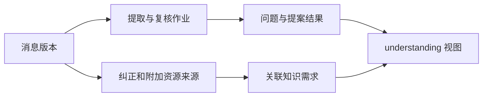

# 消息理解结果的统一状态视图

该模块把一条已捕获消息在存储、提取、复核、提案应用和知识关联等环节的分散记录，汇总为前端可直接展示的 understanding 视图；它只读取事实并判定展示状态，不负责执行理解或应用提案。

来源：gpt-5.6-sol 分析，gpt-5.6-sol 独立复核；模型解释仍可被原始证据纠正。

## 解决的问题与调用入口

`MessageUnderstanding` 是消息理解流程的**查询投影层**：它依赖 `Store` 读取持久化事实，依赖 `AssistantWork` 获取知识页与需求目录，并用 `readableMemory` 把记忆提案转成人类可读文本。参考 [模块依赖 ↗](../../../apps/server/src/messages/understanding.ts#L1 "支持该类通过 Store、AssistantWork 与 readableMemory 组合持久化数据和可读结果。")

它刻意区分“模型给出的标签”和“已经实际应用的事实”，也不把项目成员关系误当成消息引用关系；因此返回值适合驱动收件箱状态，而不是作为写入动作。参考 [事实视图职责 ↗](../../../apps/server/src/messages/understanding.ts#L14 "支持模块只呈现实际作业和应用事实，并避免把分类标签或项目归属误判为事实。")

代表性调用是 `read([{ id, revision_id, state, resources }])`。方法先为所有需求预计算已引用、已选中的来源集合，再逐条保留原始消息字段并附加 `understanding`。参考 [批量读取入口 ↗](../../../apps/server/src/messages/understanding.ts#L21 "支持 read 预计算需求来源关系，并为每个收件箱条目附加 understanding。") 如果 `revision_id` 不存在或找不到版本，它立即返回 `saving`，结果、问题、项目、需求和反馈均为空，表示原文尚未完整落库。参考 [未保存版本分支 ↗](../../../apps/server/src/messages/understanding.ts#L51 "支持缺少有效 revision 时返回 saving 及空聚合结果。")

## 从消息版本聚合可见结果

找到版本后，代码读取来源所属上下文和分配结果，查询引用该版本的最新 `extract_claims` 作业、其最新 `verify_proposals` 子作业以及角色输出。普通 abstention 会成为待用户回答的问题；`duplicate` 与 `no_durable_value` 留到说明文字；若上下文分配为歧义，其问题会排在最前。参考 [作业与问题聚合 ↗](../../../apps/server/src/messages/understanding.ts#L64 "支持查找提取和复核作业、解析输出，并区分问题与说明类 abstention。")

随后它查询证据来自当前版本或其纠正链的提案，并关联应用回执及当前记忆/事项版本。版本已经变化，或实体已失效、被替代、归档时，结果被标为 `historical`；查询最多返回最近 30 条，并额外标记是否已应用、实体 ID 与原来源是否仍为当前头版本。参考 [提案结果投影 ↗](../../../apps/server/src/messages/understanding.ts#L93 "支持提案查询范围、应用回执关联、历史状态判定和最多 30 条的输出边界。")

需求关联不是只看当前消息：来源集合还纳入会话纠正和消息附带资源；任一来源被知识页真实引用或被其计划选中，该需求才进入返回值，并分别保留 `cited`、`current` 与维护状态。参考 [知识需求关联 ↗](../../../apps/server/src/messages/understanding.ts#L134 "支持将原消息、纠正和附加资源合并为来源集合，并据引用或计划选择筛出需求。")

## 状态优先级与边界条件

作业活跃态包括 `queued`、`leased`、`running`、`retry_wait`。参考 [活跃作业状态 ↗](../../../apps/server/src/messages/understanding.ts#L12 "支持 understanding 阶段所识别的四种活跃作业状态。") 有作业时按固定优先级决定展示阶段：活跃作业或复核 → `understanding`；失败 → `failed`；存在问题或待决定提案 → `needs_context`；存在已应用且非历史的结果 → `applied`；提取成功但无新增结果 → `read`。无作业时保持 `saved`，而消息自身处于 `review` 时只改成“部分内容待补读”的标签。参考 [展示阶段优先级 ↗](../../../apps/server/src/messages/understanding.ts#L160 "支持 saved、understanding、failed、needs_context、applied 和 read 的判定顺序及 review 标签特例。")

最终视图还带回错误、无持久价值说明、项目、需求、反馈历史，以及仅限 `conversation` 范围的偏好。参考 [最终视图字段 ↗](../../../apps/server/src/messages/understanding.ts#L184 "支持最终返回错误、说明、项目、需求、反馈和会话偏好等字段。") 实现假定作业输出和提案正文都是合法 JSON，也假定目录中的需求能找到对应页面计划；这些数据若破坏约束，当前函数没有本地容错，会让解析或下游调用失败。参考 [作业与问题聚合 ↗](../../../apps/server/src/messages/understanding.ts#L64 "支持查找提取和复核作业、解析输出，并区分问题与说明类 abstention。") [提案结果投影 ↗](../../../apps/server/src/messages/understanding.ts#L93 "支持提案查询范围、应用回执关联、历史状态判定和最多 30 条的输出边界。")
