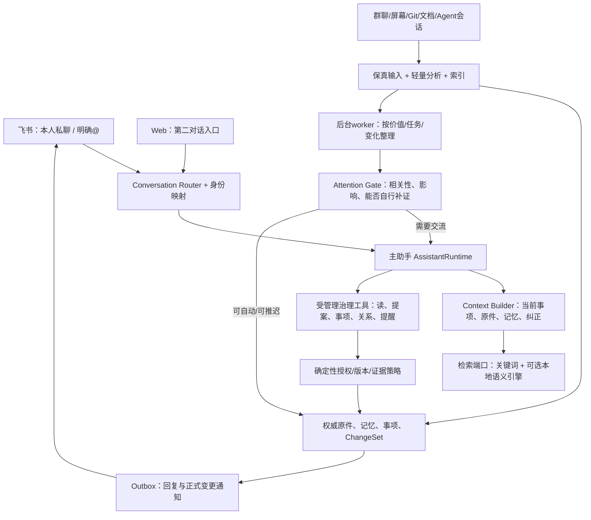

# 个人主助手与渐进记忆设计 v3

2026-09-27 · 待实现。根据用户实际体验与 [Batch 2 审查](../../reviews/2026-09-27-batch2/README.md) 修订。**飞书机器人是主要对话与助理入口；Web 是管理、检索、审计和第二对话入口。** 本轮不实现新服务、不恢复标注或群监听。

本设计覆盖并替换旧batch2中“普通材料→全量claim提炼→非自动通过就请求用户确认”的默认产品路径；保留其数据、事务、job、ACP、Lark与UI基础设施。旧验收里“未知负责人必须产生decision”等断言需要跟随新产品行为修订，不能作为保留无效打扰的理由。

## 1. 核心判断

1. 记忆库首先要**找得回原材料、保留上下文**。收录材料本身不需要你逐句批准，材料描述也不自动成为你的任务。
2. 输入时应该分类，但采用轻量、多维、可修正的分类；不是强迫每个句子归入唯一的事实/待办类型，更不是立刻构建完整本体。
3. 深度整理可以渐进。实际任务、反复使用、用户纠正、来源更新和跨来源关系决定整理优先级；不能等数据很多才有基础结构，也不能进一篇文档就产生几十个正式知识变更。
4. 低置信/缺背景首先意味着“先保留为来源、按需补证”，不天然意味着“现在问用户”。主助手只就与你相关且会改变行动的选择提出具体问题。
5. MemPalace类工具优先用于**本地材料索引和检索**，不能替代目的理解、说话人辨识或人类确认策略。先接可替换retrieval port，以小PoC决定复用，不把某个工具变成所有工作的前置依赖。

## 2. 主 Agent 的明确职责

**现在没有已经可用的飞书主助手**：基线只处理绑定、群采集、通知与卡片；普通owner私聊被忽略。planner role与answer schema的存在不等于入口已接通。需要新增一个持久的 AssistantRuntime。

主助手维护的是你的当前工作上下文：正在推进哪些事项、材料属于哪些项目、哪些事实已被纠正、有哪些未完成承诺，以及最近对话目的。它可以查询和阅读材料、回答问题、记录或更新事项、组织知识和关系、提出下一步、安排提醒，并在明确授权范围内驱动受管理工具。

它不把所有输入都当作用户指令。与你的私聊/明确@进入交互路径；被动群聊、屏幕观察、Agent日志进入记忆采集路径；内部任务状态形成有限的主动建议，不逐条聊天回声。

## 3. 消息与会话路由

`InboundEnvelope` 至少包含 `transport_event_id, app_id, tenant_id, chat_id, thread_id, message_id, reply_to, sender_external_id, principal_id, addressed_to_assistant, is_forwarded, payload_parts, observed_at, received_at, locale/timezone`。

| 输入 | 路由 | 回复/处理 |
| --- | --- | --- |
| 已绑定owner私聊“帮我找…” | 主助手交互 | 检索→引用回答，保留会话 |
| 已绑定owner私聊“记住/改成/提醒我…” | 主助手治理 | 解析意图→受管理操作→回报具体变化；已有明确授权不再重复确认 |
| 群内明确@机器人 | 按群可见范围处理的会话 | 当前话题回答；私人记忆不能因同owner提问就泄漏到群 |
| 群背景消息/截图/应用切换 | 采集→索引/轻量理解 | 默认不回复群、不创建本人任务；有价值信号交给主助手 |
| “先别问这些/暂停整理” | 用户控制意图 | 停对应建议/任务/待发通知的产生与投递，保留其他必要服务；范围明确 |
| 卡片确认/拒绝/补背景 | 绑定到已有AttentionCase | 执行一次，旧版本拒绝；自由文本回答也能继续同一个问题 |

会话键使用principal + channel + chat + thread；项目身份单独解析，不能把chat_id/application当project_id。跨Web/飞书共享owner记忆和事项，但只有用户显式关联时共用同一conversation，避免把群聊上下文误接到私聊。

一个会话同一时刻一个model turn；新的输入可以排队或明确打断。服务重启从持久ConversationTurn恢复，区分已经向飞书发出的回复与未投递内容。超时/取消不在后台继续产生未授权动作。

## 4. 模型、角色与可用工具

保留可配置CLI/ACP、model、effort、context预算；生成式LLM不要求本地。新增 `assistant` 角色，以自然对话和结构化tool calls共同工作；不再要求主对话只返回ProposalBatch JSON。

当前extractor/verifier适合有界认知任务，可以继续复用，但改成由明确工作计划调度。`source-profiler`、`episode-builder`、`task-interpreter`、`knowledge-consolidator`、`attention-triager`是逻辑角色，可共享一个后台进程，不需要一开始拆成多套常驻Agent。

| 工具组 | 例子 | 作用/授权 |
| --- | --- | --- |
| 只读 | search_sources、read_evidence、search_memories、list_tasks、inspect_relations | 返回可用范围内的固定证据，含source_attributed/历史/失效标记 |
| 低风险治理 | propose_memory_revision、link_evidence、create_task、update_task、schedule_reminder | 已知scope、明确意图、版本检查，满足策略时自动应用并通知 |
| 范围调整 | merge_topics、rename_concept、resolve_conflict、archive_memory | 先展示影响；小范围可逆可自动，较大范围经AttentionGate |
| 外部动作 | send_external_message、edit_repository、execute_business_operation | 独立executor和capability，不能继承普通写知识权限 |

自然语言“把刚才那个提醒改到下周三”不是交给LLM拼SQL：主助手先解析对象引用和时区→工具获取当前version→命令携带expected_version→commit receipt→确认具体结果。操作效果仍由后端限定；话语提案、检索文本和prompt都不能新增权限。

角色包保留prompt/skill/schema/tool hash与有效model/effort。主助手可以复用ACP session；后台语义复核用新session。绑定、权限、项目上下文或role bundle变化时更新/重建session，避免遗留敏感上下文。实现 `memory_search` 的实际工具服务；当前框架里只声明allowed_tools名称还不够。

## 5. 四层信息模型

| 层 | 保存什么 | 如何产生 | 是否需用户确认 |
| --- | --- | --- | --- |
| Evidence | 原文、图片、代码、消息/工具结果、原始时间与身份 | 已授权采集/主动输入，确定性规范化 | 不逐条确认；扩采集范围按设置授权 |
| SourceProfile / Index | 内容概览、候选主题、结构、参与者/项目线索、切片、向量/词索引 | 规则优先；有帮助时一次轻量AI分析 | 不询问普通分类；推测字段可改，不是权威事实 |
| WorkingContext | 当前任务相关材料、工作经历、临时假设、问题和待办线索 | 主对话/会话聚合/当前活动 | 可保留unknown；不自动把线索变成本人承诺 |
| Knowledge / Commitments | 可复用概念/事实/方法、确认过的决策和本人事项 | 有目的的提炼、证据验证、反馈巩固、用户明确指令 | 普通有依据小变更自动；实际选择/高影响才询问 |

这些是并存视图，不是要求每条材料都沿流程晋升。原件无论是否生成知识，都应可检索可引用。SourceProfile摘要或LLM写的中间总结始终标derived，不当新独立证据。

## 6. 用户体验应发生的变化

导入业务分享文档后，主助手可以一次回报：“已收录这份业务说明，按账号模型、额度、权限等主题建立了索引；其中包含历史演进和未来规划，回答时会带版本。”不再逐条让用户确认句子是否值得记。

当用户真的问“这个功能现在可以上线吗”，主助手检索文档、代码、群内决定，发现适用环境或版本有冲突；先自行核对当前来源，仍缺一个影响决策的信息时才问：“这次发布针对新接口还是旧接口？两份规范适用范围不同。”问题要有背景、有分歧、有回答后的动作。

当用户说“周五前我需要补齐方案，提醒我”，主助手知道这是本人直接交办，能确定时区/日期后记录并回报；若日期无法唯一确定，只问日期，不再问“这是否是值得长期保存的事实”。

## 7. 实施顺序

先修停止控制、输入身份/消息边界与质量指标；再补飞书主助手和统一只读检索；然后启用轻量分析与按需整理；最后用真实使用反馈增强聚类/关联。详细工作与验收见 [改造与验收](migration-and-acceptance.md)，worker分工与确认规则见 [处理策略](processing-policy.md)。

这是本轮新设计，不代表已有主Agent已经可用。现有Lark注册/绑定无需重建机器人；复用连接，把正常消息接到主助手即可。
