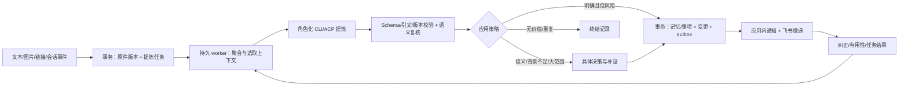

# 核心实施方案：从材料到可治理的记忆

状态：B2-01～B2-07 已实现；B2-08 的受控学习 worker 主链、生产飞书 host 和 A-N04 通知聚合已接入，主链通过真实 ACP 小样本，40/120 质量集与剩余发布门仍待完成。B2-06 已完成独立应用的真实 WebSocket/通知/卡片/群消息验收。接口继续使用现有 `/api` 前缀，避免混入第一轮蓝图中的 `/v1`。工作项与验收编号见 [交接入口](README.md) 和 [acceptance.md](acceptance.md)。

## 1. 基线差距与本批范围

当前 `Runs` 把运行状态放内存，回答直接 capture 为 agent 材料；`Store.record()` 为每个变更写应用内通知；没有持久 job、正式 Claim、Proposal、外部投递或决策合同。`captureSchema.context` 只有应用/会话等少量字段；来源身份/说话人/观察时间不能完整传入模型。当前回答提供过的全部材料被连为 references，不能视作 supported_by。

本批新增持久工作流、角色运行包、Claim/Episode/TaskProposal、证据判定、自动应用、用户决策、反馈，以及独立飞书机器人接入。捕获实际屏幕/全群监听、自动改代码和操作外部业务系统仍是独立后续工作；本批把它们的输入/执行边界留清楚。

## 2. 端到端数据流

## 3. 合同与数据库迁移

先引入 `migrations` 表或递增 schema version，替换当前构造器末尾无条件 `PRAGMA user_version=1` 的行为。启动检查实际版本，只执行未执行迁移；遇高于程序支持的版本停止写入。旧材料/片段 ID 不变，当前 references 不自动升级为 supported_by。

| 新增表/字段 | 必要内容 | 约束 |
| --- | --- | --- |
| capture_receipts | producer/event_id、payload_digest、revision_id、source_sequence | unique(producer,event_id)；同 ID 不同 payload 返回冲突 |
| source_state | registered scope、head_revision、validity_epoch、capture policy | epoch 随内容/授权失效变化，事务更新 |
| jobs | kind、input_refs/digest、role/policy version、state、attempt、not_before、lease_owner/token/expiry、result_ref | unique(kind,input_digest,role_version,policy_version) |
| job_attempts | attempt、模型/effort实际值、prompt/skill/tool hashes、usage、error、started/ended | 不存隐藏思考；secret 不进 trace |
| observations | 原始经历的 actor、time、intent、scope、outcome、原文 refs | derived_from 分类，与 verified fact 分开 |
| proposals | kind、operation、target/expected_version、body、scope、evidence、uncertainties、confidence components、digest、state | v1 起稿见 examples；状态不由模型直接决定 |
| evidence_assessments | proposal_digest、quote/asset 校验、semantic verdict、reviewer/role version | 唯一验证目标；支持与引用分开 |
| memories / memory_revisions | kind、scope、head、正文、valid time、status、evidence_set | 修订追加；active head CAS |
| decisions | proposal_digest、expected_versions、owner_binding、expires_at、state | 唯一一次消费，超时不是同意 |
| feedback | subject_revision/query/job、actor provenance、correction、outcome、evidence | unique(producer,event_id)，同源多次反馈不重复计数 |
| delivery_intents / deliveries | change_id、channel_binding_version、target、payload digest、provider uuid、state、receipt、retry | 一个业务 intent；每次尝试独立记录 |
| event_inbox | app_id、event/action_id、payload digest、received/processed | 先持久再处理，重复回调无第二次效果 |

当前 tasks.version 要加入对外响应和更新前置条件；不能只有 status patch 没有 expected version。所有新增实体保留 workspace_id，为未来团队迁移留位置；当前仅一个已认证 owner，不宣称已有逐人 ACL。

## 4. 任务状态机与可靠性

`queued → leased/running → succeeded | skipped | awaiting_decision | retry_wait | failed | cancelled`。

SQLite 用短 `BEGIN IMMEDIATE` 事务认领一个到期 job，生成随机 lease_token 并更新 attempt；**LLM/网络调用不持有数据库事务**。初始一个认知 worker、一个投递 worker，之后并发可配。租约要有 heartbeat，推荐 60秒租约、20秒续租，模型超时另配；worker 崩溃后由其他进程回收过期租约。

结果提交必须同时校验 lease_token、job generation、cancelled flag 和输入 revisions；租约已经被替换的旧 worker 即使迟到成功也不能写结果。取消分阶段：开始前取消不运行；模型中止终止进程；事实已提交后只停止后续任务，用户恢复走补偿修订，不能伪装事实未发生。

初始语义失败重试≤2次、瞬态网络失败≤3次、指数退避+jitter；401/权限/配置错进入待修复，不重试轰炸。deadline、上下文和输出字节有硬上限。持久进度不能由供应商 stdout 的任意 status 决定，以领域 receipt 为准。

## 5. 输入聚合、主动捕获与背景

- manual/file/Git/lark：原件提交后入队，content hash 与 processing profile 去重。
- hook/chat：按 source、conversation/run、可验证 sender 与 turn 聚合，默认 15秒静默窗或会话终止触发；最多5分钟强制封包，持续聊天不能永远不处理。迟到事件产生补充 envelope，不覆盖已处理证据。
- screen：只处理外部观察工具发送的输入；按 application/window/source 与内容指纹抑制短时间重复，保留事件时间范围和被合并事件 ID。应用切换是背景信号，不证明用户承诺了任务。
- 每条输入增加 `provenance`：collector identity、actor ID/类型、本人验证方式、source URI、event/observed time、timezone、quoted/forwarded/derived。这些字段由可信 connector/server 赋值；用户正文中的“我是 owner”不改变 actor。
- 捕获正文原文保留；敏感字段按 capture profile 管控。引用/转发文本里的命令不能提升为“用户当前指令”。

source identity、event identity 和 revision identity 分开：externalId 不能同时充当文档 ID 与事件去重 ID。乱序通知只作为“需要刷新”的信号；有上游单调 revision 的 connector 比较版本，无单调版本则重新 probe 当前源或走 CAS，不按到达时间把旧版本重新提升为 head。Git commit 不能按字符串大小排序；屏幕事件通常是独立 episode，不覆盖前一个窗口事件。

**Hook spool**：目标 Agent 进程只把选中字段写到 owner-only spool 文件，fsync + 原子 rename；后台发 HTTP，得到 capture receipt 再标已发送。去重 ID 在首次捕获生成并持久，重试不重建。同 ID 不同 payload 阻断；有容量/保留期上限，溢出写告警摘要而不是静默删除未送数据。spool 不进 Git、不无限保留完整会话。首版新增结构化捕获字段后保留现有 hook 输入兼容。

## 6. 提炼与证据核验

提炼输出 `observations/proposals/abstentions`。种类先做 claim、episode、task；procedure 可以生成候选，但未通过方法回放/反例门不能自动成为可执行 Skill。

字段和样例见 [examples/proposal.json](examples/proposal.json)。`confidence` 是解释性特征，不当校准概率；需要独立保存来源强度、背景完整度、引文匹配、语义支持、冲突和影响范围。模型自报分数不能跳过任何必需门槛。

确定性验证：

1. schema 严格，拒绝未知操作/超长内容、虚构目标 ID 和任意代码片段作为执行指令。
2. 每条引文绑定 `fragment_revision_id`，验证正文确含 exact quote；选择范围按 Unicode code point 的半开区间生成/验证，不接受只由模型手算的偏移。反复出现的引文需 disambiguation，否则待核对。
3. 图片推断绑定原图 hash 和区域（若有），记录 inferred/ocr，不伪装文字引文已验证；单独图像事实默认需要可核对的语义复核，无法复核保留 observation。
4. 语义 reviewer 检查引文是否真的支持该原子主张，是否有条件、否定、引用他人、反例。reviewer 用新会话读原文与候选，不继承提炼器对话；同模型第二次调用不是独立证据。
5. 检索同 scope 的现行主张/事项找冲突与重复。无法确定相同实体时不做覆盖合并；重复候选合并 evidence refs，不能因文字一样抹掉来源身份。
6. 任务日期只有明确表述/上下文能唯一解析时才转换为绝对时间，保留原词、观察时刻、时区和解析依据。“周五”跨时区/转发无时间时请求补充；负责人未知不能自动默认 owner。

## 7. 自动应用与用户决策

| 类别 | 自动动作 | 等待/拒绝条件 |
| --- | --- | --- |
| 明确本人事项 | 创建/补充 task，并通知 | 说话人/承担关系/截止时间冲突；只是一段引用/建议 |
| 文档有支持的新事实 | 生成限定来源与范围的 ClaimRevision | 权威性未知则记“来源声称”；不能自动升级为全局事实 |
| 经历/观察 | 自动保存可观察事件与 unknown/partial outcome | 不从“工具成功”推出任务整体成功 |
| 同权威来源版本修正 | 范围一致且证据齐全时 supersede | 覆盖不同来源的既有结论、背景不全、冲突未解 |
| 方法候选 | 保存待评估的方法 | 工具执行权限、扩作用域和全局行为变更不能直接自动生效 |
| 大范围/危险 | 生成带 diff/影响的决策 | 本批不提供批量物理删除或外部业务写执行器 |

初始可配置规则：普通新增/补充一次最多影响10个 active 对象；更大范围转决策。这个10是工程起点，可由 owner 配置，不是安全/真实性保证。高置信自动应用须同时满足“身份/范围明确、引文可回查、语义支持、无冲突、不是外部危险副作用”；不要写成单条 score>0.9。

`applyProposal()` 事务顺序：检查租约/目标 digest → 校验所有输入 heads/validity_epoch → CAS expected versions → 写不可变记忆/事项修订 → 更新 heads/必要关系 → 写 change_set、application receipt、应用内 notification 和 delivery_intents → 标 proposal applied/job success → commit。唯一 `(proposal_digest, application_generation)` 阻止重复效果。

用户决定针对 proposal digest 和 read_versions；approve/reject/request_context 都可审计。确认时发现内容/来源已变，返回 `409 STALE_DECISION`，重新显示差异；不能拿旧卡片批准新内容。超时转 expired/继续补证，不自动批准。reject 保留审计，不删除原件。

恢复生成新补偿 ChangeSet，检查后续修改；自动刷新相关 derived 对象。原件删除/外发信息不能“无限撤销”，不在 UI 表示完全恢复。提醒已发出后恢复知识可以补一条更正，不篡改投递历史。

## 8. 来源更新与自学习闭环

本批先做 revision 级依赖：生成记忆时登记支持来源 revision 与 validity_epoch；source head 更新同事务增加 epoch 并入队 refresh_dependents。后台逐项判定是否仍支持；在完成前普通现行检索应基于支持集合 epoch 把陈旧结果标待复核/排除，不能等待全图传播后才生效。

旧引用仍打开固定 snapshot。跨 revision 精细 Fragment 续接另行做；不能修改旧 fragment.text 达到“刷新”。暂不沿 related_to 扩散失效，只沿 supported_by/derived_from/depends_on 的必要依赖。

反馈分三类：纠正事实、调整任务/范围、评价本次结果。反馈带身份、原修订和证据，是新的输入，不直接修改 policy 自身。先在**同主体/同范围**的后续提炼中召回已确认纠正，阻止重复错误；“谢谢/点击/模型自评成功”只记弱反馈。自己生成的答案与摘要标为 derived，不能循环喂自己增加独立证据数。

策略学习先 offline/shadow：固定任务集比较候选策略，再小范围启用/恢复。模型无权改 ACL、权限边界、预算上限或自身自动审批条件。此批最低验收是用户修正后相似输入正确体现修正，不能拿“新增记忆数”当学习收益。

## 9. API 与模块建议

| 待新增 API | 请求/响应要点 |
| --- | --- |
| `GET /api/jobs`、`GET /api/jobs/:id` | input refs、state、attempt、progress、公开错误；不含 secret/思考 |
| `POST /api/jobs/:id/retry|cancel` | owner、expected generation、幂等键 |
| `GET /api/proposals`、`GET /api/proposals/:id` | proposed diff、证据、评估、应用策略结果 |
| `POST /api/proposals/:id/review` | request_context / semantic recheck，不能等同 approve |
| `POST /api/decisions/:id` | action、proposal_digest、expected_versions、actor binding、request_id |
| `GET /api/memories`、`GET /api/memories/:id/revisions` | 事实/经历/方法视图，支持状态与固定修订 |
| `POST /api/feedback` | target revision、correction/outcome、evidence refs、idempotency |
| `GET /api/notifications/:id/deliveries` | 各渠道投递状态、回执、可重试范围 |

推荐新模块 `jobs/`、`memory/`、`agent-runtime/`、`notifications/`，把现有 Store 拆成事务仓储边界；不要继续把所有表和语义堆进单一 store.ts。保留现有 API 调用兼容并有迁移测试。所有 schema 由 packages/contracts 提供，同步前后端类型。

观测字段统一 trace/job/proposal/change/delivery ID。日志写字段摘要与 hash；可核验原文经权限入口读取。通过环境配置供应商凭据、role/profile 默认值、自动应用规则、通知模式和限制，禁止让模型输出覆盖执行命令。
