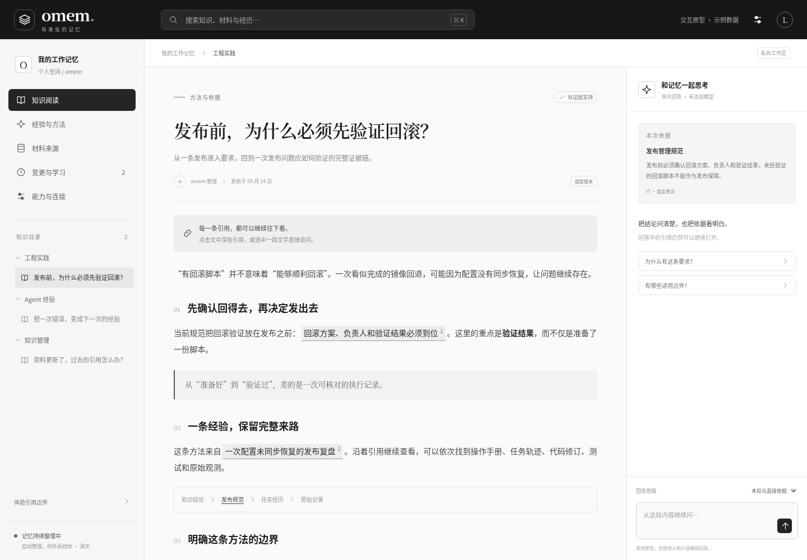
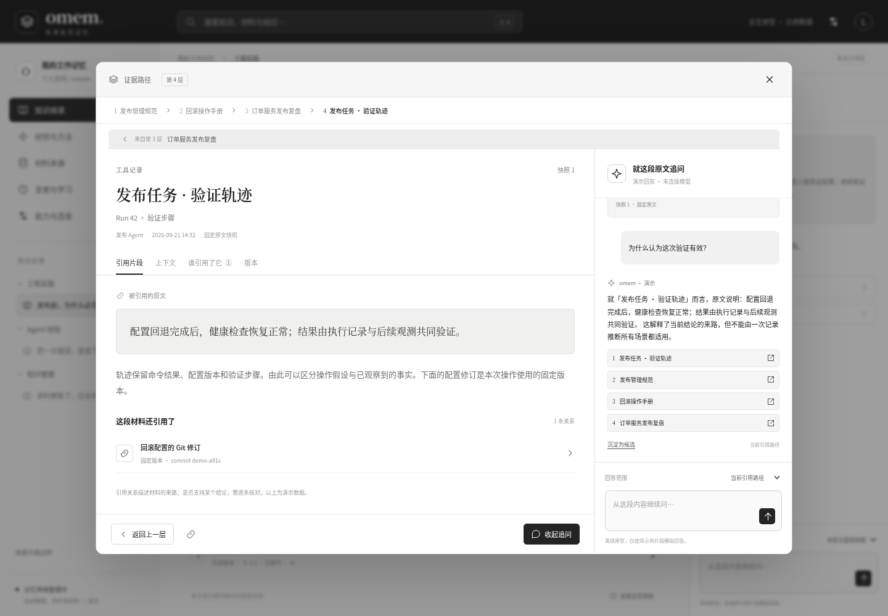
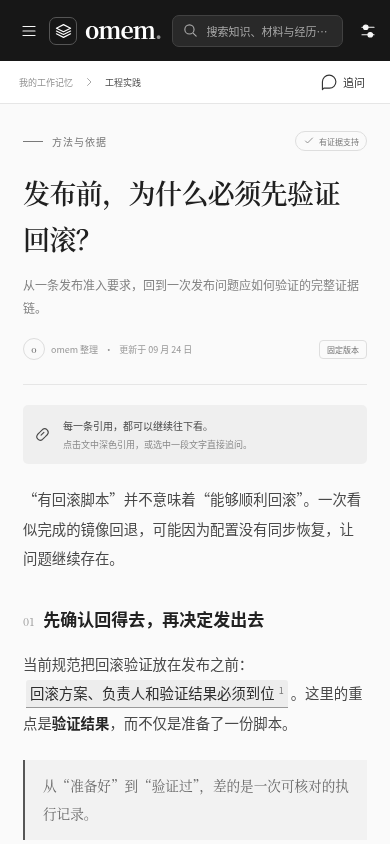

# omem 交互原型

直接用浏览器打开 [index.html](index.html)。它包含全部脚本与样式，无 CDN、API key 或后端依赖；支持 `file://` 打开，也可以用任意静态 HTTP 服务预览。只发送 HTML 给别人也能体验。

## 已实现的交互

- 三篇知识文章、材料/片段搜索、空状态。
- 8 层业务示例引用链、100 层合成链；renderer 不设深度上限。
- 弹窗面包屑、上层返回、Esc 退一层、关闭恢复起始焦点。
- 原文/上下文/反向引用/版本页；历史与现行对比；循环引用提示。
- 弹窗内追问、圈选追问、回答引用继续展开、停止生成、问题草稿与历史保留。
- 回答范围改变引用集合；所有回答明确标为模拟。
- 无权限/已删除/锚点不确定状态，不伪装原文可见。
- 经验→验证→方法浏览、例外判断、模拟同步、引擎启停。
- 变更差异和恢复为新记录，localStorage 保留演示历史，可重置。
- 桌面/手机布局，字号与密度调整。

此原型未连接 LLM、真实数据源、数据库或记忆引擎。问答使用确定性示例模板，范围选择只演示上下文/引用变化；学习和同步动作不会启动真实后台任务。恢复操作只改变演示历史，不修改正文中的静态知识 fixture。完整策略、权限和副作用语义见技术方案。

## 修改与构建

```bash
cd docs/prototype
npm ci
npm run build
```

`app.jsx` 是 React 交互逻辑，`data.js` 是虚构示例图，`styles.css` 是样式；`build.mjs` 将这些打包到单个 `index.html`。React/ReactDOM 18.3.1、esbuild 0.28.1 均固定在 lockfile。不需要运行 esbuild 才能打开已交付 HTML。

`tweaks-panel.jsx` 来自本机 lark-apps creative-design starter，已去掉未使用的建议聊天 addon，并增加 React import；本原型仅使用其风格面板。React/ReactDOM 的 MIT 通知见 [THIRD_PARTY_NOTICES.txt](THIRD_PARTY_NOTICES.txt)。

## 浏览器检查

```bash
npx playwright install chromium
npm test
```

已有浏览器时可用 `OMEM_CHROMIUM=/path/to/chrome npm test` 指定。测试用 `file://` 打开 HTML，检查长链、环、版本、圈选与追问、同步、恢复、搜索、移动布局及零外部请求；输出 [verification.json](verification.json) 与截图。

示例数据通过 `localStorage['omem-demo-v1']` 保存变更历史，问题草稿/会话保存在本次页面内存。截图是验证产物，不是虚假的生产页面。

## 预览






