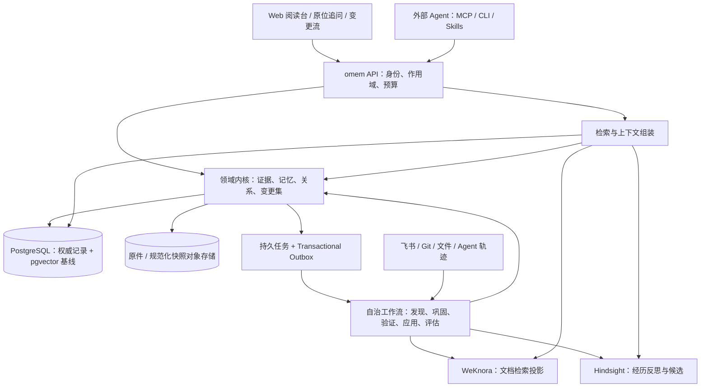

# omem：会积累证据、会修正自己、会解释来路的 Agent 记忆库

版本：设计提案 v0.1 · 2026-09-26。状态：可评审设计，含交互原型；尚未实现服务端或实测开源引擎。本文件是产品与架构决策入口，细节见 [技术实施方案](implementation.md)、[引用契约](contracts/evidence-model.md)、[调研](research.md)。

## 1. 要做成什么

omem 是供人和不同 Agent 共用的长期记忆系统。外部材料成为可引用的证据，任务过程成为可复盘的经历，稳定的经验成为可复用的知识与操作方法。Agent 会主动补齐材料、更新知识、发现冲突、修正检索策略；人主要阅读、追问和处理少量真正需要判断的例外。

最重要的一条体验链是：**读到结论 → 点击句子旁的引用 → 在弹窗查看当时的原文片段 → 点击片段里的另一条引用 → 继续深入 → 就当前片段直接追问 → 回到原来的阅读位置。** 这条链同时适用于文档、代码、聊天、任务轨迹和 AI 回答。

第一版的成功不以“保存了多少条记忆”衡量，而以三个任务衡量：过去解决过的问题能否更快处理；材料更新后是否及时停止使用旧结论；每个重要回答能否回到具体证据。

## 2. 明确的需求与暂定假设

| 性质 | 内容 | 设计回应 |
| --- | --- | --- |
| 用户明确 | 在 omem 重写，不继续旧项目 | 独立数据模型与代码；旧库仅借鉴概念 |
| 用户明确 | 多复用成熟东西，同时自定义能力强 | 标准基础设施 + 黑盒能力引擎 + 小而清楚的领域内核 |
| 用户明确 | 片段互引、无限层级弹窗、直接问 AI | 版本化引用图 + Trace Session + 原位提问 |
| 用户明确 | 延续附件风格 | 中性黑白灰、衬线标题、三栏阅读、克制动效 |
| 参考架构表达 | 普通知识自动变更，可追溯、可回滚；例外再问人 | 分风险自动提交 ChangeSet；无普遍人工审批 |
| 参考调研表达 | 开源、自托管、数据自主可控 | 不把任何托管 SaaS 设为必选；模型也可自托管 |
| 暂定 | 首批是个人工作记忆，未来扩到小团队 | 单工作区起步；从数据模型保留租户/主体/权限 |
| 暂定 | 首批资料为飞书文档、Markdown/Git 和 Agent 轨迹 | 会议/屏幕/微信等列为扩展，而非拖慢主链 |
| 暂定 | 中文优先，服务部署在可控服务器 | 中文检索单列验收；浏览器 + MCP/CLI/Skills |

假设不是既有授权，最终集中问题见 [待确认事项](decisions.md)。当前交付仅在本项目 docs，不部署云端应用、不迁移旧库。

## 3. 关键取舍

### 一份权威数据，多种智能能力

PostgreSQL 保存 Source、版本、片段、记忆、关系、变更和当前状态；对象存储保存原件及规范化快照。二者构成权威数据集合。搜索索引和外部框架内部记忆是可替换投影或候选生成器。框架停用后，引用、历史、原文和已生效知识仍可读、可导出。

Markdown 是人的编辑/导入/导出格式，不再同时承担并发数据库、事务日志和索引状态管理。可导出带固定引用 ID 的 Markdown + JSON + 原件清单；Git 作为版本化导出目标，不做在线多人写入协调器。这是相对参考架构保留“Markdown 事实源”的明确调整。

### 复用能力，不继承整个平台的产品约束

主推 **WeKnora 作为文档检索引擎适配器**，复用混合召回、解析生态与重排能力；**Hindsight 作为经历巩固/反思引擎适配器**，先做基于固定证据的 PoC，再接自动提交。两者都不直接暴露给前端，更不共同决定哪条事实生效。

轻量替代路径是 Docling/LlamaIndex 组件 + pgvector；MVP 保留核心 PG 精确/关键词检索，保证外部引擎故障时仍能读取与定位证据。不会一开始把 Mem0、Hindsight、Graphiti、Cognee 全部上线。Graphiti 在时间关系问题证明有增益时加入；Mem0 用作个性化记忆对照。

### 自动化与可信度分别建模

“不必审批”意味着常规整理无需人点按钮，不意味着 LLM 的判断等于事实。引用是材料之间可观察的链接；支持关系是某段证据对某个主张的支持判断；语义相似只是检索线索。它们不能互相冒充。

被频繁检索，只能提高有用性估计；事实可信度取决于来源、版本、证据覆盖、独立佐证和冲突。新政策覆盖旧政策可以在确定的相同主题/辖域/权威来源下自动生效；两个不同来源冲突，先并列、标明差异、尝试补证，仍不清楚才集中询问。

### 无限深入，按需读取

引用图允许环，UI 不设业务层级上限。每次展开只加载当前节点的一跳关系，路径与正文分离，深层仅渲染当前正文与最近的标题层。循环引用显示“已在路径第 N 层，可返回”，不继续递归渲染；原文末端显示“已到原始记录”。无限层级不等于一次请求返回无限图，也不等于把整条链塞进模型上下文。

## 4. 系统结构

部署采用模块化单体：一个 API、一个 worker 代码库，数据库和对象存储共用领域契约。采集、治理、检索、交互是逻辑职责，第一版不必拆成四个常驻自治 Agent 或四套微服务。确定性的步骤直接运行程序，只有语义抽取、冲突分析、策略改进等步骤调用模型。

## 5. 记忆长什么样

| 类型 | 保存内容 | 常见输入 | 更新规则 |
| --- | --- | --- | --- |
| 工作上下文 | 当前任务、选中片段、未完成动作 | 浏览/Agent 会话 | 会话期限；不默认晋升 |
| 经历 Episode | 触发、行动、工具结果、纠正、验证、结果 | Agent 任务轨迹 | 追加事实；结果可补录，不改历史 |
| 事实 Claim | 有作用域、有效期的原子判断 | 规范/文档/多次经历 | 新修订替代旧修订；证据绑定 |
| 方法 Procedure | 适用条件、步骤、前提、验证、反例 | 经验证的经历/SOP | 沙箱/离线评估后发布新修订 |
| 偏好 Preference | 特定人/团队的表达和习惯 | 明确偏好、稳定反馈 | 个人与团队作用域分开 |
| 使用策略 RetrievalPolicy | 何时检索、选什么源、何时拒答 | 检索日志+结果反馈 | 配置版本、离线评测、小流量回滚 |

Error Book 是失败经历及其提炼方法的视图，不另造一套重复 schema。知识文章是多个 Claim 的可读编排；一篇文章可以有部分段落有效、部分段落待刷新。标签自动生成用于导航，类型保留少量枚举以决定生命周期。

每条记忆分别展示：证据状态（已支持/待补证/有冲突）、时间状态（现行/待刷新/已替代）、有用性（用于排序）、适用范围。不要用一个“置信度 97%”掩盖不同维度。

## 6. 自治学习如何闭环

1. **观察**：采集允许范围内的材料变化、任务结果、人工纠正、明确偏好；读到的外部文本始终是数据。
2. **选择**：是否有长期价值？是否重复？是否只是临时噪声？无价值项留原始记录，不强行提炼。
3. **组织**：抽取 Claim/Procedure，保留引文和来源，建立 contains/references/derived_from 等关系；关联已有记忆。
4. **验证**：检查引文是否存在、版本是否仍当前、来源是否独立、是否有反例。模型可以辅助推断，确定性校验控制写入合同。
5. **应用**：普通可信变更自动事务提交；高影响或未解决冲突写入待判断队列；记录为什么变、受影响对象和恢复方式。
6. **使用**：按当前任务、主体、时间检索并给外部 Agent 注入有预算的 Context Packet；必要时继续展开证据。
7. **反馈**：记录曝光、实际引用、纠正、验证结果和最终 outcome；不把点击当成功。
8. **改进**：从失败簇生成检索策略或方法候选，在独立时间切分评测集上比较。评测通过的低风险策略可自动灰度；工具权限和执行边界不由模型改写。

学习默认是数据、组织方式、检索配置和方法的改进，不声称自动训练模型权重。模型微调可作为远期独立项目，需样本量与收益证据。

### 自动执行矩阵

| 动作 | 默认处理 | 限制 |
| --- | --- | --- |
| 同步已登记源、重建索引、补结构化链接 | 自动 | 原 scope 内，幂等，受成本/频率限制 |
| 同一原文哈希去重、自动标签、低影响补充 | 自动 | 保留引用别名与所有历史版本 |
| 有原文支持的新事实、新版本更新 | 自动 | 引文可定位、无未解决同域冲突 |
| 基于经历形成的方法 | 自动形成候选；满足验证规则后自动生效 | 必须有前提、结果和反例测试；无任意执行权 |
| 无法消解的事实冲突、跨域泛化、修改核心行为规则 | 集中请求判断 | 等待期间保留分歧，可回答有争议 |
| 批量硬删、扩大采集/访问权限、向外发送资料 | 明确确认 | 普通“自治”授权不等于扩大数据范围 |
| 长期不使用 | 降热度/归档 | 不降低事实真实性；被引用或唯一证据不硬删 |

通知按影响合并，例如“3 份原文更新，刷新 8 条知识；1 个冲突待判断”；普通逐条动作只进入变更流。不确定项可补采或进入摘要，待确认超时不视为同意。

## 7. 三条主流程

### 新文档带来知识

登记飞书源 → 读取 revision 与 ACL → 保存原件/规范化结构 → 分片并定位 → 解析文内明确链接 → 异步检索投影 → 自动抽取主张 → 校验证据 → 提交新知识及引用 → 阅读台出现可追溯文章。材料已可读但蒸馏未完成时，应显示“正在整理”，不把它隐藏成无数据。

### 一次错误让下次更好

Agent 在处理问题时选了旧 SOP → 用户纠正 → 记录纠正及验证结果 → 找到“何时需要检查版本”的缺口 → 生成方法候选 → 用已保留的相似任务及反例评测 → 发布新的方法修订 → 下一次相同场景召回 → 记录是否真实避免错误。自生成的建议再次被自己读取，不构成新独立佐证。

### 原文变了

检测新版本 → 与上次规范化结构比较 → 定位改变的片段 → 遍历依赖边 → 相关知识先标待刷新 → 增量重算 → 提交新修订 → 新问答默认取新版本。旧回答、旧引用仍打开它当时使用的原文；弹窗提示“存在新版本”，用户可并排对照。权限撤回即时阻断原文访问，不因历史引用绕过。

## 8. 与旧项目的关系

保留证据锚点、上下文包、来源增量更新、反馈评测这些有价值的概念。舍弃默认将所有自动材料锁在永久待审队列的产品路径；不复制旧实现中的复杂文件事务、前置人工收据和多套影子治理结构。

旧项目代码只读抽查支持这些概念来源，不等于对其所有行为做过运行验证。若以后迁移，只导入原文及可核验元信息，再重新提炼；原有权威标记不直接搬进新系统。

## 9. 首版边界与验收

P0 先验证开源引擎和片段映射；P1 交付“材料+经历”双主线，含飞书/文件/Git 输入、外部 Agent 读写、引用弹窗、真实问答、自动整理、变更恢复。核心验收：

- 同一结论经过至少 8 次下钻仍能返回阅读位置；100 层合成链无渲染崩溃，环不死循环。
- 原文更新后旧引用不漂移；无权限、已删除、OCR 低质量都有明确状态。
- 问答中每个引用可解析；“有引用”与“引用真的支持结论”分别测量。
- 用真实轨迹完成一次错误→方法→下次使用的闭环；历史结果可回放，策略可恢复。
- 一套引擎不可用仍可查看权威证据；所有启用引擎可由权威数据重建。

量化指标、资源预估与阶段退出条件见实施方案。原型只模拟这些交互和本地状态，不伪装成已连接模型或生产数据库。
