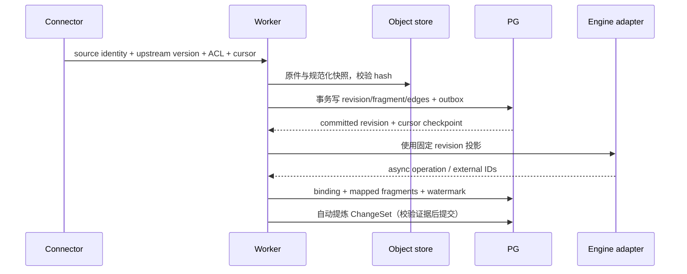

# 技术实施方案

日期：2026-09-26 · 提案 v0.1。与 [design.md](design.md) 和 [证据契约](contracts/evidence-model.md) 配套。本文给出实现边界与验收，不表示服务端已经建成。

## 1. 工程形态与复用边界

推荐 Python 作为后端/worker 语言，因为核心记忆与文档库生态集中在 Python；Web 用 React + TypeScript。暂不增加 Go 领域服务，WeKnora 作为独立进程由 HTTP adapter 调用。若最终用户倾向全 TypeScript，权威内核可换语言，跨引擎仍用相同合同。

```text
apps/
  api/                 FastAPI；REST/SSE、鉴权、MCP 同源领域服务
  worker/              Celery tasks；ingest/consolidate/evaluate/project
  web/                 React、TanStack Query、Radix Dialog、Tiptap 扩展
packages/
  domain/              Source、Evidence、Memory、ChangeSet 与策略
  contracts/           Pydantic/OpenAPI、生成的 TS 类型、事件 schema
  connectors/          lark、git、files、agent-run
  adapters/            weknora、hindsight、pg、object-store、models
  evaluation/          数据集、judges、shadow 对照、回归报告
  integrations/        CLI、MCP server、Skills 模板
deploy/                Compose 开发配置；生产部署与备份手册
docs/                  本次设计与原型
```

复用：数据库、pgvector、对象 SDK、任务队列、文档解析、检索/重排、模型客户端、无障碍组件。自研：版本与引用合同、记忆作用域/生命周期、ChangeSet、上下文预算、框架映射、评价结果的发布策略。协议包禁止依赖具体引擎，避免数据形状被单一 SDK 锁定。

## 2. 权威存储与事务

使用 PostgreSQL + SQLAlchemy/Alembic。表分组如下；所有用户对象含 `tenant_id`，时刻统一 UTC，UI 用用户时区展示。

| 表 | 核心索引/约束 | 用途 |
| --- | --- | --- |
| principals / memberships / acl_policies | tenant/principal，ACL epoch | 用户、Agent service principal、来源授权 |
| connectors / sources | unique(tenant, connector, external_key) | 登记和抓取水位；凭据保存 secret_ref |
| source_revisions | unique(source, upstream_revision, parser_profile_hash) | 原件和规范化快照；重复通知幂等 |
| fragments / node_revisions / fragment_revisions | node registry FK，source_revision+ordinal | 跨版本身份与固定片段 |
| memories / memory_revisions / articles | head revision FK，kind/subject/scope/time | 人与 Agent 共用知识 |
| reference_edges / evidence_assessments | tenant+from revision/type；tenant+to revision/type | 下钻、反向引用、影响分析 |
| runs / episodes / outcomes / feedback | unique(host, run, event_id)，query_run ID | 失败/成功/纠正闭环 |
| change_sets / applied_events | unique(tenant, idempotency_key)，aggregate+sequence | 原子变更与恢复 |
| jobs / outbox / delivery_receipts | topic+dedupe_key；state+next_attempt_at | 有界后台任务、投影、通知 |
| adapter_bindings / adapter_generations | engine+external ID；canonical revision；watermark | 索引可重建，排除陈旧结果 |
| retrieval_runs / evaluations / policy_revisions | dataset_version+policy_version | 检索诊断、学习灰度与回滚 |

关系图首先存 PG adjacency，不上独立图库。`references` 允许环；`contains` 必须无环；`supersedes` 不允许回到祖先。变更影响只沿依赖性边遍历，不沿全部 related_to 扩散。高 fan-out 分批任务，队列去重并记录累计范围，避免更新风暴。

SourceRevision 对象存储写入先用内容寻址临时 key，校验 hash 成功后在 PG 事务引用；事务失败留 orphan，由延迟 GC 清理。PG 引用的对象必须已持久；对象不可用显示可恢复故障。跨 PG/对象存储不假定分布式事务。

审计采用追加事件 + 当前状态同事务 + 可重建投影，**不在第一版实现全域纯 Event Sourcing**。事件记录 actor、cause、before/after revision references 和 schema version；不把模型输出正文/凭据反复复制进日志。敏感对象可加密，key 由外部 secret/KMS 提供。

## 3. 摄入链路



Connector interface：`discover(cursor)`、`probe(source)`、`fetch(revision)`、`permissions(source)`、`normalize(raw)`；返回 upstream revision、inventory completeness、etag/content hash、限流信息。事件只作变化线索，读取上游真实版本再去重。watermark 只在权威原件提交后前进；投影有独立水位，失败不重抓已提交原件。

没有原生 revision 的文件源以 raw hash 作为 version key；统一 `version_key = native_revision or raw_hash`，不可依赖 nullable upstream_revision 的 SQL unique 来去重。元信息/ACL 更新与正文更新分流；解析器变更由 processing profile hash 产生新规范化修订，复用相同原件。

- 飞书：优先原生 API/block IDs，保留 revision；Wiki 解析到真实对象；内嵌文档/表格/附件独立登记，保留父子引用。分页完整性明确，网络失败不当删除。
- Git：固定 commit/blob，仅读取 refs；路径+symbol+line span；rename 记录身份映射；不自动执行仓库脚本。
- 文件：检查类型、大小、解压限额；Markdown/HTML 结构解析；PDF 复用 Docling 或通过 WeKnora parser 产物，含页码/bbox。
- AgentRun：入口同时支持主动 SDK/MCP 写入和被动 host hooks。保存用户可观察的事件、工具输入输出引用、纠正、结果；不要求或采集模型隐藏推理。显式 capture profile 限定来源、字段和保留期。

主动发现的资料只在已登记 namespace/allowlist 范围内抓取；新域名/新工作群成为建议，不自动扩大凭据使用范围。Connector 权限变更独立于普通内容变更，每轮同步检查，撤权优先使知识不可注入。

## 4. 引擎适配器与一致性

不要设计一个让所有框架必须实现 `evolve()` 的巨大接口。能力拆分为：

```python
class RetrievalAdapter(Protocol):
    async def index(self, batch: ProjectionBatch) -> ProjectionReceipt: ...
    async def search(self, query: ScopedQuery) -> list[CandidateRef]: ...
    async def remove(self, refs: list[CanonicalRevisionRef]) -> RemovalReceipt: ...
    async def health(self) -> AdapterHealth: ...

class LearningAdapter(Protocol):
    async def observe(self, episodes: list[EpisodeRef]) -> OperationRef: ...
    async def propose(self, scope: LearningScope) -> list[MemoryProposal]: ...

class ParserAdapter(Protocol):
    async def parse(self, asset: ImmutableAssetRef) -> StructuredDocument: ...
```

模型/connector/adapter 通过版本化 manifest 注册：capabilities、契约版本、配置 JSON schema、成本估计、超时、数据出境/出网策略、权限粒度。简单配置/提示变更不要求 fork；确需代码时提供 Python entry point 或进程级 HTTP/gRPC worker。非可信插件在容器/独立进程运行，无权直接连接权威 DB。启动做契约版本协商，缺能力明确拒绝，不能 silently fallback 为权限更弱模式。

### WeKnora 映射

先持久 omem 原件；每个固定源修订单独上传引擎，记录 returned knowledge ID。异步解析完成后分页读 chunks，按 source locators 或唯一文本范围映射到 canonical fragments。映射可能 1:N，记录 exact/partial/unresolved。`skip_context_enrichment=true`；RRF 在 omem 融合时不假设不同引擎 score 可比较。命中后 hydrate 权威片段并复核 ACL/hash/状态，无法映射的候选不进入带支持标记的答案。

如果上传成功但写 receipt 前进程崩溃，outbox 重试可能产生重复外部文档。先按 op/binding 对账；上游不支持幂等时可接受外部暂时重复，canonical 层按 ID 去重并做孤儿清理，不声称 exactly-once。引擎按 ACL 等价类分 KB/索引，避免无权内容先进入引擎 rerank/model；过细 ACL 无法表达时在权威层筛出允许的 document IDs 并传 filter，超过限制改用内核路径。

### Hindsight 映射

`document_id` 使用单个 Episode/FragmentRevision 的稳定 omem ID，metadata 记录版本/hash（不放 secret）。每个访问集合使用隔离 bank；一份 bank 内的 observation 可能联合多份证据，不能事后按标题过滤保证 ACL。bank/ACL 变化需停用旧派生结果、重建或重新验证依赖。

`retain` 完成后 `recall` 用于经验候选，observation/reflect 用于学习提议；通过 `source_fact_ids → document_id → canonical revision` 找回所有支持原文，再生成 omem Proposal。若缺出处，仍可作为研究假设而非自动事实。已经生效的 omem Claim 不循环作为“新的原始经历”重喂同一学习器。

### 投影协议

队列至少一次投递，唯一键为 `(adapter, canonical_revision, generation, operation)`；每个 adapter 单独 watermark 与失败队列。检索结果需满足当前 ACL、有效性与可用 generation。源/记忆被撤回时，权威读取立即过滤，外部删除异步重试。index generation 构建完成后原子切 active pointer；embedding 模型/维度/归一化变化创建新 generation，不混用向量。

高扇出依赖的 stale 标记可能异步完成。查询不能只检查记忆行上的标志：必须检查支持集合绑定的 source heads/validity epochs；来源 head 改变而尚未完成影响核验时，现行问答把依赖结果标记待刷新/不确定，历史查询仍可按固定版本读取。由此消除“更新已发生、标记还没传播”的陈旧注入窗口。

## 5. 自治任务、发布和停止条件

任务类型：refresh_source、extract_claims、consolidate_episodes、resolve_conflict、refresh_dependents、propose_procedure、evaluate_policy、notify_digest。任务记录 parent/cause、读过的版本集合、模型/提示版本、token/cost、尝试次数和 effect receipt。一个任务最多 6 个语义步骤、2 轮补证（初始配置），达到预算/时间后产出部分结果或待判断，不自我派生无限任务。

初始策略举例（阈值可调，非已验证最优）：新支持事实与来源更新自动；语义合并必须保留所有不同前提，不能只按相似度阈值；一次影响超过 50 个现行对象或修改全局方法进入待判断；每日 token/cost 硬限额。阈值在 P0 数据上校准，不作为“模型置信 0.8 即真”的捷径。

事实冲突先检查 scope、valid_time 和来源角色：不同地区/时间的差异可能共存。相同权威文档的 r8 替代 r7，可更新有效区间；群聊说法与制度冲突只登记 dissent。二者均可疑则自动补采，仍无法消解才通知人。未决主张默认不参与确定性回答，允许以“资料存在分歧”呈现双方可见证据。

Procedure 候选包含 trigger、preconditions、steps、tools/capabilities、verification、failure/rollback、counterexamples。默认是供 Agent 参考的可读步骤；转为可执行 Skill 是另一个部署动作，必须满足宿主权限与签名/版本策略。学习不能修改自身 budget、ACL 或工具授权。

发布策略：固定样本集离线评估 → 相同输入 shadow → 小范围应用 → 监控回退。保留 champion/challenger 配置 hash、dataset version、seed/model version。人可以在变更流恢复上一策略；大模型自评不能独占发布决策。

## 6. 检索与上下文组装

1. 网关认证服务主体，解析 tenant/project/user/time 和任务目标。用户自报 tenant 不能覆盖 token。
2. 轻量规则路由：固定证据读取直接查 PG；事实问答走文档引擎；“上次怎么处理”走经历；时间问题走 time filter/必要图；复杂问答最多并行两类主引擎。
3. 每路取候选，按 canonical revision 去重。RRF 初始 `k=60`，权重可配，不能平均不可比的原始 score。
4. 权威 hydrate：校验访问、status、版本、证据映射。查冲突和现行继任者；需要历史回答时按 `as_of` 过滤。深关系扩展默认 2 hops/40 nodes，只沿指定边。
5. rerank 在一处执行；超时返回已验证候选并显式标注 degraded。普通检索不每次调用 LLM 仲裁；复杂语义矛盾才开 reflection。
6. 构建 Context Packet，预算默认 4k tokens：focus、facts、procedures、episodes、conflicts、evidence refs。预算优先保证焦点与支持片段成对，不能只留下结论删光证据。
7. 记录 exposed/selected/cited 与 final outcome；没有答案则 abstain，提供缺少的证据类型或下一步检索建议。

ACL 需在召回前限制引擎数据、召回后 hydrate、生成前、证据展开与缓存命中时检查。Derived memory 的有效权限默认不宽于所有必要证据交集；若有独立公开证据可支持，则生成只依赖公开材料的新修订，而不是直接放宽旧修订。

## 7. API 与集成合同

以下均为 **omem 拟定 API**，与上游已核验 API 分开：

| API | 行为/约束 |
| --- | --- |
| `POST /v1/sources` / `POST /v1/sources/{id}/sync` | 登记源/创建 job；idempotency key；异步返回 202 |
| `GET /v1/sources/{id}/revisions` | 游标分页；无权标题不泄露 |
| `GET /v1/evidence/{revision}` | 固定片段、来源状态、邻边分页、支持评估 |
| `GET /v1/nodes/{revision}/relations` | outgoing/backlinks、types、cursor；每次一跳 |
| `POST /v1/search` | 搜索材料与记忆；包含 degraded、generation、trace_id |
| `POST /v1/context` | 给 Agent 的预算化 packet；更少 UI 信息 |
| `POST /v1/runs/{id}/events` | 幂等 append；异步抽取，不阻塞宿主任务 |
| `POST /v1/memories/proposals` | 外部 Agent 候选入口；统一 policy 分类 |
| `POST /v1/answers` | 当前片段/选区追问，SSE；引用逐条验证 |
| `POST /v1/feedback` | query_run、used_refs、correction/outcome、producer |
| `GET /v1/changes` / `POST /v1/changes/{id}/restore` | diff/历史；If-Match head；恢复前返回影响预览 |
| `POST /v1/decisions/{id}` | accept/reject/edit；绑定方案 digest+read versions |
| `GET /v1/jobs/{id}` / `POST /v1/jobs/{id}/cancel` | 状态/成本/重试；取消未来步骤，不撤回已提交事实 |

写操作要求 service principal capability + Idempotency-Key；对象更新 If-Match，冲突 409；过期 decision 409、权限不足 403（或隐藏存在性 404）、限流 429+Retry-After。错误结构 `code, message, retryable, trace_id, details`；不回显敏感正文。

MCP 第一版工具：`memory_search`、`memory_context`、`evidence_read`、`memory_observe`、`memory_feedback`、`change_preview`；独立可写 capability 才提供 `memory_propose`。普通外部 Agent 无 DB/批量删除能力。Skills 只教何时读写、如何提供 evidence/outcome，不能绕过服务端规则。CLI 直接调用同一 SDK。ACP 为编辑器会话桥接扩展，不把它当跨 Agent 通讯总线。

飞书作为数据连接器与通知渠道分别授权；通知 outbox 绑定 target、digest、delivery key，可重试/去重。企微、个人微信能力与可用 API 不混为一谈；后续接入前确认具体渠道。屏幕感知只做可选桌面采集器，应用 allowlist、可见采集状态、可暂停、短保留期。

## 8. 运维、成本与可观测性

开发运行：API + worker + PG/pgvector + Valkey + 本地对象目录；按 profile 启动 WeKnora 及其 parser 依赖/Hindsight。上游自己的 DB/schema/迁移用户分开，无权修改 omem 表；避免共用同一 schema 的版本冲突。生产要求共享对象存储、TLS/OIDC、secret 注入、备份恢复、资源限额；不把上游 demo compose 当生产配置。

观测链：source event → job → ChangeSet → projection receipt → query_run → answer → feedback，全链统一 trace ID。记录 ingest lag、mapping failure、projection lag、stale injection、引用解析失败、ACL 拒绝、token/cost、自动变更恢复率、待判断积压。日志只带 ID、状态和经过筛选的诊断信息。

资源规划假设：10k 材料，平均 8 片段=80k 片段；1024 维 float32 单份向量裸数据约 312.5 MiB（80,000×1,024×4）。HNSW、元数据、版本、replica、各引擎复制会进一步增加，不能把此数当总内存。原件平均 0.5 MB 时原件约 5 GB，未含多版本/媒体。首轮用 8 vCPU/32 GB 的无 GPU 测试机测组合服务峰值，属于起测预算而非运行保证。

每日增量假设 100 份×4k 输入 tokens=400k tokens。费用模型 `input_tokens×input_price + output_tokens×output_price + embedding_tokens×embedding_price + rerank_units×price`；分别记录抽取/反思/问答，不给未指定模型编造人民币成本。用 hash 去重、变化片段抽取、批量 embedding、限时 reflection 控制重复开销。

PG 做增量备份/PITR；对象启用版本/校验与保留策略；恢复时先恢复权威集再重建投影。初始内部服务目标 RPO≤1h、RTO≤4h（待用户确认与演练），不是已达成 SLA。物理删除的备份保留和已外发副本在 UI 说明实际范围。

## 9. 分阶段实施与退出条件

以下工期为 1 名熟悉全栈的开发者的粗估，模型/API 权限、已有基础设施会影响；按验收而非日历推进，总计约 9–13 周，P0 后重估。

| 阶段 | 粗估 | 交付 | 退出条件 |
| --- | --- | --- | --- |
| P0 合同与选型 PoC | 1–2 周 | 30 份脱敏混合材料、20 个任务轨迹；WeKnora/Hindsight adapter spikes；原文映射与部署记录 | 100% 已显示引用可解析；不可靠映射明确拒绝；导出/重建/撤权测试；按质量和资源选 A 或 B |
| P1a 证据工作台 | 2 周 | PG/对象 schema、文件/飞书输入、引用图、三栏 Web、真实片段追问 | 新旧版本共存、至少 8 层链、100 层合成链、循环与权限状态、段落引用正确 |
| P1b 经历与自治闭环 | 2–3 周 | Git/AgentRun、Episode→Claim/Procedure、低风险自动提交、MCP/Skills、恢复 | 真实失败→纠正→方法→再次使用；幂等重放、恢复冲突、模型失败不写坏事实 |
| P2 评估与团队化 | 2–3 周 | 检索策略 shadow/灰度、团队 ACL、通知摘要、完整备份恢复、源更新依赖重算 | 无越权注入，策略改善且无关键回归，依赖传播和灾备演练通过 |
| P3 按收益扩展 | 2–3 周起 | 需要时引 Graphiti/会议音视频/更多渠道/ACP | 每个扩展有明确数据集与增益；屏幕等单独确认采集范围 |

P0 首批开发任务：①生成共享 schema/fixtures；②原件→source revision→fragment locator→resolver 纵向切片；③WeKnora 导入/检索/删除/重建映射；④Hindsight 单 Episode retain→proposal 证据回查；⑤30 文档/20 轨迹对照；⑥形成正式 ADR 和版本锁定。不要先写泛化插件商城或多引擎管理 UI 再做主链。

## 10. 评价与测试

测试数据首轮至少 120 个问题：中文术语/代码错误码 25、精确片段与跨文档 25、历史与更新 20、经历/方法 20、无答案/冲突 15、权限/删除/投毒 15；独立冻结一份按时间切分的 holdout，避免根据同一测试集学习再宣称提升。真实用户材料须在本地脱敏/授权范围内使用。

| 指标 | 定义 | 初始验收目标（待 PoC 校准） |
| --- | --- | --- |
| 引用可解析率 | 展示的引用中，resolver 能读到对应固定片段的比例 | 100%（权限撤回等显式状态另计） |
| 引用支持准确率 | 人工抽查结论确由该片段支持 | ≥95%，由人工标注集验证，不仅 LLM 自评 |
| Evidence Recall@10 | 预期原始证据是否进入前 10 候选 | ≥90%，按任务类型分别报告 |
| Forbidden/stale injection | 越权、禁止使用或已明确失效材料被注入 | 权限/删除安全集 0；stale 单独统计 |
| Abstention accuracy | 无答案场景正确说明不足 | ≥90% |
| 方法有效性 | 对同一任务族，任务成功率/错误复发/步骤成本 | 比无记忆基线提高且无安全集回归；不先编造百分比 |
| 引用展开延迟 | 已索引固定片段 resolver，内网 warm p95 | ≤300ms，排除大媒体首次下载 |
| 检索/回答首段 | 检索 p95 / 模型首段 p95 | ≤2s / ≤5s 起始预算，实际依模型及引擎测 |
| 自治质量 | 自动生效后被恢复/纠正的比例、待判断占比 | 持续下降；不能通过不产生记忆刷指标 |

必要的故障测试：重复 webhook，乱序 revision，PG 提交前后崩溃，上游成功本地未记 receipt，模型超时/格式无效，索引陈旧，备份恢复，撤权命中缓存，召回到跨 tenant 相同 ID，生成中撤权，merge 后恢复，重复语义自证，恶意原文包含工具/授权指令，UTF-16/码点选区、PDF OCR 和重复段落错位。

本次原型验证覆盖交互行为与状态；不替代上述服务端测试。生产实现需要在每个 adapter 对锁定上游版本跑契约测试，不用 TypeScript 类型强转掩盖实际字段缺失。
