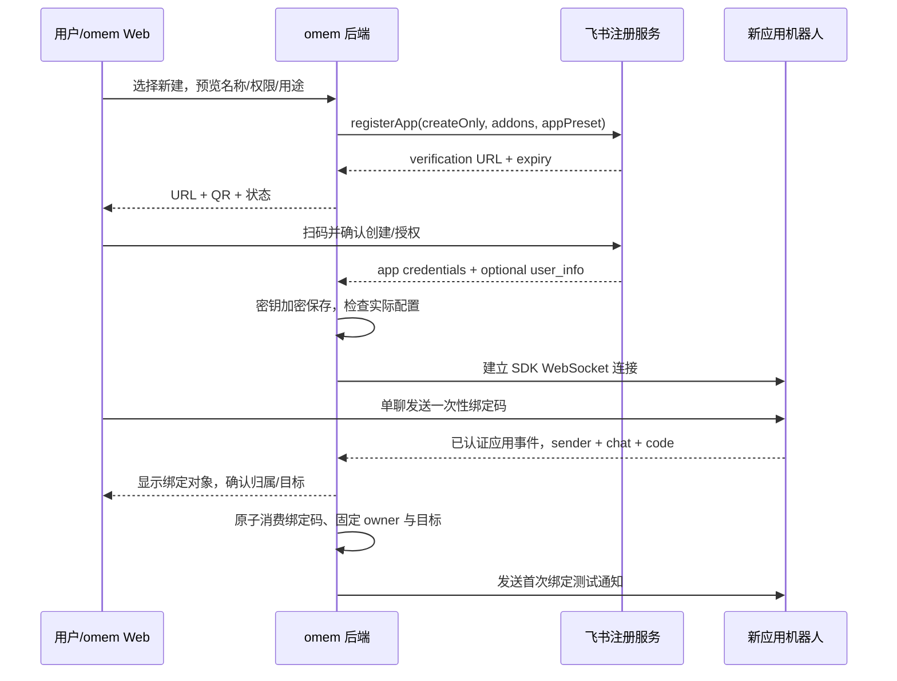

# 飞书：独立机器人、扫码创建与绑定、可靠通知

状态：B2-05 注册/密钥/配对/绑定和 B2-06 消息连接、投递、回调核心已实现。本轮没有调用创建/授权/发送测试消息的业务 API；确定性测试不能替代独立测试应用 live 验收。实现使用官方 SDK `registerApp()`、`WSClient` 和 `Client`，但不假设能无需用户授权静默创建。

## 1. 是否需要新的机器人，是否照 botmux 做

**推荐给 omem 单独配置一个企业自建应用机器人**，拥有自己的 App ID/Secret、事件连接和通知 owner。可选择绑定用户已有的专用应用；不应默认挪用当前 botmux 会话机器人的凭据或复用另一个应用下的 open_id。

体验可以像 botmux：点“连接飞书”→创建/已有应用→扫码授权→验证并绑定→立即可收通知/发指令。但实现优先使用飞书当前官方 `registerApp()`，不复制整个 botmux daemon、会话调度和后台网页登录自动化。

已核对 botmux 源码 revision `597ffb10172ea9ac2b50b75507d52a8cf5fb0cd7`：其 setup 支持 Web 登录态创建、选择已有应用、手工凭据和 SDK `registerApp()` 兼容路径，并对消息/群/资源权限、事件与 callback 做回读。omem 不调用 `botmux setup/clone`，但提供只读 `BotmuxExistingAppProvider`：从显式 `OMEM_BOTMUX_CONFIG` / `BOTS_CONFIG` 或默认 `~/.botmux/bots.json` 列出可复用 app（公开响应不含 secret），按用户选定 app_id 把凭据转存到自己的加密 secret store，之后仍执行 capability probe 和同 app pairing。它不修改 botmux 配置，也不复用 botmux 的隐式当前会话。

| 路径                        | 适用                                   | 限制                                                                                          |
| --------------------------- | -------------------------------------- | --------------------------------------------------------------------------------------------- |
| 独立自建应用 + 官方扫码创建 | 默认，长期个人助理、单聊/群聊/卡片交互 | 用户扫码确认，租户策略可能要求管理员                                                          |
| 已有专用自建应用            | 用户已有 bot，避免重建                 | 支持扫码更新、手工凭据或从本机 botmux 注册表按 app_id 复用；检查现有连接/配置，不能无提示覆盖 |
| 群自定义 webhook bot        | 临时单向群通知                         | 无完整单聊/消息接收/绑定身份能力，不足以满足长期助理                                          |
| botmux 适配                 | 用户已使用 botmux，快速桥接            | 绑定/授权/发送目标由 transport 合同管理；不能直接依赖 `botmux send` 的隐式当前会话            |

## 2. 已核验的官方能力

官方 [一键创建应用 NodeJS](https://open.larkoffice.com/document/mcp_open_tools/integrating-agents-with-feishu/scan-to-create-an-app-in-one-click-nodejs) 描述 `@larksuiteoapi/node-sdk >=1.61.1` 的 `registerApp()`，基于 RFC 8628 device authorization，用户打开链接/扫码确认后返回 `client_id/client_secret` 和可选 `user_info.open_id/tenant_brand`。

本轮检查 node-sdk commit `394c83092395a51402ee408b751d7f9fb05f5518`，源码 package version `1.74.0`：`scene/registration/types.ts/index.ts/addons.ts` 包含 `appPreset`、`addons.preset`、`createOnly`、`appId`、AbortSignal 和 polling/slow_down/domain_switched。这是源码能力核验，不代表所有≥1.61.1版本都具备所有新字段；实施时选择实际发行包并验证完整选项。

`addons.preset=false` 可从最小机器人基座开始显式申请 scopes/events/callbacks。源码同时提示 extra config 可能受平台灰度影响，未知权限名会被确认页忽略；所以收到凭据后必须实际检查/探测，不能把 SDK 请求配置当已生效配置。

**不要复制官方示例中的 console.log(client_secret)**。omem 只在后端接收凭据，立即放 secret store；日志、浏览器、job payload、截图和 Git 都不出现真实 secret。

## 3. 创建绑定完整流程

流程状态：`draft → awaiting_scan → credentials_received → checking → awaiting_pair → active`，分支 expired/denied/cancelled/failed。应用创建成功不等于 omem 绑定成功。扫码超时/拒绝不生成 active binding；取消后迟到的凭据不能悄悄重新启用。应用可能已在外部创建成功，保留“需核对的已有 app_id”，不要无条件再建一个或擅自删应用。

创建意图和一次性 owner setup token 必须由已认证 Web 会话/本机 CLI 发起，不能开放给匿名互联网；现有 shared token 可以先作为单用户 setup 权限，但返回 QR 的 endpoint 不携带主 token 到 URL。

### 绑定规则

- binding identity 为 `(tenant_brand, tenant_key若可得, app_id, owner_open_id)`，通知目标为同一 app 上核验的 p2p/group chat_id。open_id 视为应用相关 ID；不要复制当前对话另一 bot 的用户 open_id。
- 即使注册返回 user_info，也需对该新应用做实际联系验证；字段可能缺失，不能推测 owner。推荐始终使用一次性 pairing code + Web 回读确认，统一新建/已有应用路径。
- pairing code 使用至少128-bit随机量、5分钟有效期、存 hash、一次消费、失败限流；不能用6位验证码当唯一远程凭据。私聊验证事件证明对方控制相应飞书账号；最终 Web 确认把它绑定到当前 omem owner，抵御转发 QR/绑定码抢占。
- 绑定码只可用于绑定，不能授权任意危险操作；过期/重放/其他 app 来的相同字符串均拒绝。
- 绑定群为通知目标时，通过绑定 owner 发出的明确选择和 bot 在群的 membership 核验；加入群不等于授权采集整群。群采集需额外 allowlist、权限和可见告知。

## 4. 凭据和权限配置

`LarkConnection` 保存 app_id、secret_ref、domain、状态、实际核验过的 capability profile、binding_version 和 owner/targets。secret store 独立加密，master key 来自环境/系统密钥存储且不与密文同库备份；恢复/轮换要验证旧连接停用。App Secret 不进入模型上下文，模型不负责决定发送目标。

按能力分阶段申请，示例范围在 [examples/lark-registration.json](examples/lark-registration.json)：

| 能力                | 初始权限/订阅（核对实际目录）                                                                                                         |
| ------------------- | ------------------------------------------------------------------------------------------------------------------------------------- |
| 主动发消息          | `im:message` + `im:message:send_as_bot`                                                                                               |
| 收取本人私聊/绑定   | `im:message.p2p_msg:readonly` + `im.message.receive_v1`                                                                               |
| 加群后响应 @        | `im:message.group_at_msg:readonly`、`im:message.group_at_msg.include_bot:readonly`                                                    |
| 授权群内持续观察    | `im:message.group_msg`；要包含其他机器人消息再加 `im:message.group_msg.include_bot:read`。是否采集仍由 omem target allowlist 单独控制 |
| 群与成员核验        | `im:chat:read`、`im:chat.members:read`；不申请建群/加人权限                                                                           |
| 查 owner/机器人身份 | `contact:user.base:readonly`、`application:bot.basic_info:read`，按所用核验 API 确认                                                  |
| 待判断卡片回调      | `card.action.trigger`；更新消息按 `im:message:update`                                                                                 |
| 图片/文件输入       | `im:resource`，按实际 endpoint 与 app 范围检查                                                                                        |
| 状态变化            | `im.message.updated_v1`、`im.chat.member.bot.added_v1`、`im.chat.member.bot.deleted_v1`                                               |

不为通知默认申请文档写入/删除、批量发用户、通讯录全量读取。文档采集继续使用用户已授权的 lark-cli；机器人应用权限与 lark-cli user token 是两条授权链，不能互相替代。

用户确认页的实际权限可受平台灰度/企业策略影响。后台展示申请配置与核验状态，缺项给出官方后台入口或再次扫码增量授权；不能自动绕过管理员发布/审批。已有 app 更新使用明确 appId；新建使用 createOnly，避免误改已有应用。

## 5. 消息、连接与通知投递

使用官方 Node SDK 的 Client + WSClient。企业自建应用支持 WebSocket 接收消息与新版 card.action.trigger，不需要给事件接收配置公网回调 URL；HTTP API 负责发送/更新。不能由此推断 Web 详情页也能被用户手机访问：详情链接仍需可访问且鉴权的 HTTPS 地址，或先在卡片里展示必要信息。禁止把 `127.0.0.1` 详情链接发给远程用户当可用入口。

当前 B2-06 组件以显式依赖装配：`LarkConnectionManager` 负责 connection lease、pairing 消息路由、WS 状态和失效连接关闭；`LarkEventInbox` 负责事件持久化、冲突检测、自消息过滤和群监控 allowlist；`LarkDeliveryWorker` 负责 outbox；`LarkCardActionService` 负责快速入队和异步业务决策。默认 `main.ts` 不会在没有 master key、真实 capability probe 与用户连接动作时自动启动外部连接。

一个 active connection 由持久 lease 选出唯一消费者；多机滚动升级避免两个不共享 inbox 的消费者争抢事件。断线由 SDK 重连，omem 记录健康状态、最后事件/错误；未知断线缺口不能承诺完全补齐历史，需要按已允许范围补拉。

DeliveryIntent 在业务提交同事务创建，sender 从队列取；通知内容包含修改前后摘要、原因、影响、固定 evidence refs、change/decision ID。模板确定性渲染，无需让 LLM 生成收件人或控制卡片动作。即时/短窗合并/定时摘要可配置；每个 change 都有可追溯 delivery 映射，不能只展示批次最后一条。

官方 `POST /open-apis/im/v1/messages` 支持 `uuid` 去重，窗口为1小时。同一 intent 的重试保持同一个 uuid，不要每次生成新的。投递状态为 queued/sending/delivered/retry_wait/unknown/failed；超时可能外部已发送：窗口内可同uuid重试，超出窗口且无法对账保持 unknown 并提示处理，不能宣称 exactly-once。保存 provider message_id、payload_digest、binding_version、发送时间和错误分类。

uuid 最长50字符；卡片/富文本请求体官方上限30KB、纯文本150KB，渲染后按UTF-8字节数检查。超限先确定性缩短摘要/分页，每个分片保留change映射，不能因自动重试不断生成新uuid。图片先使用该应用的资源上传接口，不能拿飞书文档素材token直接当消息图片key。

限流按 Retry-After/SDK建议退避；401/secret失效/移出群停止对应 target 并提示配置，不无限重试。切换绑定版本时旧 intent 不自动转发给新群：显式迁移/取消，避免把旧私人内容发给后来绑定的目标。

## 6. 回调与具体决策

SDK 官方长连接要求回调在约3秒内处理，回调处理器只做身份校验、nonce检查、**持久写 event_inbox/decision command**，然后快速 ACK；耗时核验/应用异步完成并更新卡片。不能先回“批准成功”再尝试写数据库。

回调校验：实际接收的 app/tenant、operator 必须匹配 binding owner；message_id/chat_id 属于该条投递；action nonce/digest/expiry/expected_versions 与存储一致。action.value 是不可信输入，不允许携带任意命令、目标URL、收件人或新的 proposal body。

状态更新采用 compare-and-set：同一卡片连点、Web与卡片同时批准、approve/reject竞态，最多一次业务效果。stale decision 更新卡片为“资料已变化，需重新查看”，不能批准不同内容。用户修改后执行先生成新 proposal digest，再重新验证，不沿用旧批准。

业务方案确认与 ACP 工具权限确认分开：前者可能长期等待，后者依赖还活着的 session/turn。第一批工具权限仍可拒绝并告知；不要在机器人层写“用户点批准→给所有 Agent bypass_permissions”。

## 7. 新 API 与验收

已实现 `POST /api/integrations/lark/onboarding`、`GET .../:id`、`POST .../:id/cancel`、`POST .../:id/pairing-code`、`POST /api/integrations/lark/bindings/confirm`、`GET /api/integrations/lark/status`；另有 `GET .../reusable-apps` 与 `POST .../existing` 支持手工或 botmux app_id 复用。请求必须是 owner 操作；响应只有 app_id/状态/QR链接，永不返回 secret。WebSocket/event、notification sender 和 callback worker 已提供可装配组件；`POST .../test`、disconnect 和 B2-07 设置界面尚未提供。

A-L01～07 已用注入的官方 SDK adapter 边界、真实 SQLite 和真实加密文件完成确定性验收；测试没有发起外部注册。`LarkOnboardingService` 只有同时获得 32-byte 环境 master key、registration adapter 和真实 capability probe 才应挂到 HTTP host，避免在无法回读权限时先创建应用再误报可用。

A-L08～14/A-N01～05 的本地故障测试已覆盖 lease、重连状态、事件去重/身份、Card 2.0 callback 校验、DB 写失败重投、stale/竞态、移群停用、SQLite 重启、同 UUID 重试、`unknown`、限流/认证和旧绑定取消。A-N04 当前只通过逐条即时投递部分，短窗合并/定时外发摘要待后续实现。由于没有得到本轮创建/授权独立测试应用的明确动作，真实 WS/发送/卡片闭环全部标记 live skipped；新建应用、扫码、群绑定必须由用户参与。
