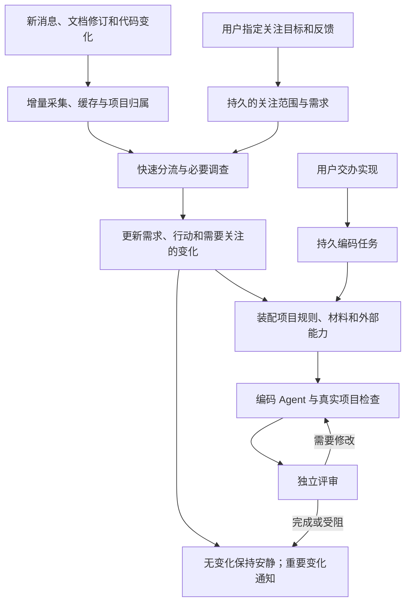

# 主助手怎样持续跟进并交办编码

更新：2026-10-06。本文区分已经接通的主助手操作与仍在推进的外部能力。现有命令的实际用法见[需求跟进与编码](requirement-followup.md)。

用户已经确认默认策略：**自动跟进指定的需求；用户交办实现后，AI 自主编码、检查和独立评审。** 主要入口是已绑定的飞书机器人私聊，网页用于阅读和可选调整；CLI 是 Agent 调用和排障的入口。普通订阅群聊里的本人确认也可以更新约定，无须重复向机器人交代。自动编码不包含自动推送、合并或部署；这些沿用目标项目和用户的明确授权。

## 现在到底接到了哪里

| 能力 | 现在的实现 | 仍未完成 |
| --- | --- | --- |
| 跟进消息和材料 | 增量采集、缓存去重、项目归属；主助手可选择项目持续维护同一需求 | 不会扫描所有群聊自行扩大采集范围；复杂项目归属仍需评估 |
| 维护需求与反馈 | 主助手建立、调整范围、暂停/恢复；独立保存关注点、用户原话和可撤销反馈；变化进入持久调查队列 | 复杂项目的周期回顾；关注范围选择的模型可靠性 |
| 跟进个人行动 | 主助手 follow_action/unfollow_action 复用 RequirementTasks，将明确行动关联到同一待办；停止同步保留待办，需求更新保留人工修改 | 多行动的自然语言选择仍需更多真实项目验收 |
| 后台实施和评审 | 明确交办后持久排队；独立 Git 副本、项目检查、新会话评审；服务重启续跑同一任务；对话恢复受阻任务、显式应用刚查看的评审补丁 | 同副本重规划已接；已应用任务、真实业务变更仍待验收，Claude 实验适配缺认证 |
| 外部能力 | 个人库登记 skill 快照、只读 CLI、标准 MCP；主助手按需读取，编码任务固定选择，独立评审补查同一回执；Codex 会话关闭继承的个人工具 | 真实 Figma/公司 Git 环境验收、OAuth 编排、已应用任务的后续迭代，以及 Claude 实际编码验收 |

`app.ts` 注入同一个页面服务、AssistantWork 和 DevelopmentQueue。主助手的 `work_catalog` / `work_status` 查询真实状态，模型提交 `work_action` 候选；宿主核对本人会话与当前交办、持久应用后才返回成功回执。阅读材料和快速模型分数不能启动编码。HTTP 的 `/api/work` 也读取同一状态。

机器人运行入口现把普通本人私聊交给同一 AssistantRuntime，仅配对码进入配对流程；它也注入相同 AssistantWork。`answer_question` 保存当前本人原话并关闭对应开放问题，纠正和关注点可通过原有 `feedback` 调整，操作都返回真实回执。群里 @机器人时只使用该群可见材料，不向群回复泄漏私人项目；普通群确认由只读采集后的后台调查处理，与私聊工作指令分开。

需求持续调查新增 `read_followup_state`、`read_tasks` 和 `read_conversation`：前者包含实际个人事项、编码阶段与受检结果，后两者支持按项目/事项及会话分页补读，均基于固定允许快照，不触达飞书未读状态。助手先查“是否已有提醒/检查”“短回复回答了什么”，再决定是否有真正需要本人选择的问题。只有阻塞的 decision 经既有主人通知绑定投递，同一问题摘要去重；调查缺口和可选补充留在资料区。无绑定时保留站内变化。

自动整理合并 12 秒内的连续更新；仅执行状态变化时局部维护旧解释，仍独立核查。需求事实修正最多一次，风格建议不触发全文循环。具体流程与局限见[需求跟进](requirement-followup.md)；这减少了流程中的重复阶段，但端到端耗时和多项目准确性仍需真实材料验收。

### 受阻之后继续、应用结果和跟进个人行动

“环境修好了，继续刚才的任务”会提交 `resume_development`，为原任务追加后台执行，保留同一副本和代码。运行中的交办先保存，当前阶段结束后处理。仅执行进度换版不触发重编码；目标、验收或原始依据变化时等待最新需求完成调查复核，编码 Agent 对比新旧要求和当前实现，保存短调整计划，保留未受影响部分，再检查与独立评审。持续维护开启的已交办任务也会自动发现这类变更，取消/暂停不会自动恢复，未交办的需求不会因此开始编码。已应用任务需要从更新后的登记仓库重新交办。

普通交办由主助手直接派发目标和资料，不要求它预先收集仓库规则或检查命令。编码 Agent 在独立副本读取适用规则、skills 和实际脚本，配置本任务的缺失检查。编码、宿主和独立评审共用真实检查日志，相同代码/命令/执行环境的成功结果复用；依赖准备、代码改动、失败或重启需要重新确认。独立评审重新判断需求和实现，有具体疑点才重跑，不例行重复整个测试循环。

“把这份评审通过的补丁应用回项目”先读取 `work_result` 的差异、检查与评审，只有当前副本仍匹配评审版本才提交 `apply_development`。后台在锁内再次核对相同评审指纹、原仓库的基线/未提交修改和需求有效性，再应用补丁。回执先表示排队，完成后状态才是 applied；原仓库保留未提交修改，不自动提交、推送或部署。应用失败不会盲目重试；修正环境后由新的明确交办重试。底层文件写入与 SQLite 不是跨介质原子事务，异常断电时需根据真实文件核对，不能推断一定未应用。

“将这项行动加入我的待办”通过 `follow_action` 选择当前需求版本里明确的行动，复用 RequirementTasks → MemoryService → ApplicationRepository，关联与回执一起保存。需求换版同步同一待办；手动修改保留，需重新选择跟进才恢复同步。`unfollow_action` 只停止同步，不删除或取消个人待办。`work_status` 同时返回行动和已关联待办，助手不需要重新创建另一份任务。

快速意图建议现可区分恢复编码、应用补丁和关联待办；仍只建议补读方向。实际操作使用当前本人私聊原话，由宿主核对，不能由历史材料或快速模型得分授权。生产效果需真实验收，不以类别增加代表收益。

## 用户应该怎样使用

一个贯穿消息、需求、设计与代码的例子：

1. **“帮我盯工单完成入口，只关心本期上线阻塞和需要我回答的事。”** 助手找到对应项目和材料，保存关注范围；只有项目无法区分时才请用户补充。后来收到需求文档、会议决定或群聊回复，继续维护同一需求。
2. **“批量完成不在本期；小李只负责接口，页面由我做。”** 助手记录这次纠正，调整范围和责任理解，说明受影响的行动。不能把它永久泛化为用户从不关心批量功能。
3. **“这部分交给你实现，用这个仓库和 Figma 节点。”** 主助手确认可用项目与能力，将需求版本、设计、代码基线和验收交给编码 Agent，立即返回任务和当前阶段，不让聊天请求一直等待到编码结束。
4. 编码 Agent 自主调查、修改和检查；独立评审读原始需求、实际差异、设计和检查结果。需要修改就带着具体问题回修。
5. 助手返回实现结果、可以查看的差异、实际检查和剩余问题。后续反馈继续进入同一任务；有新目标或验收变化时重新规划受影响部分。

第 1、2 步的管理动作、第 3 步的后台派发，以及结果查询、受阻恢复、显式应用和行动待办关联已接入主助手。通用外部能力装配已实现；远端 Git 准备、固定提交、刷新和失败重试已接入；具体 Figma 服务与私有业务环境验收仍待完成；未应用任务的同副本变更续做已接通，已应用后的迭代仍需重新交办；真实自然语言验收的结果及局限见 [progress.md](progress.md)，不沿用旧 CLI 验收冒充本轮通过。

图中的需求更新提供编码上下文；装配与执行只有编码任务启动后才运行。**启动编码仍需要用户交办**，不能因为群消息出现“帮忙改一下”就自动运行。

## 关注点与反馈应该保存什么

仅修改文章的 goal 或给 prompt 追加一段话不足以支撑长期跟进。需要把下面三类内容分开，仍共用现有项目、需求和材料身份。

| 内容 | 例子 | 更新方式 |
| --- | --- | --- |
| 需求事实 | 本期范围、验收、决定、责任人、当前实现 | 从消息、文档和代码调查，保留来源与有效版本；冲突时记录待澄清问题 |
| 用户关注策略 | 只关心上线阻塞、忽略重复报警、明天检查反馈、暂时停止跟进 | 用户随时调整；助手可在既定目标内调整调查重点，但不得覆盖明确指定的优先级 |
| 人工反馈 | “这是提议，不是决定”“负责人理解错了”“这部分交给你实现” | 保存原话、时间、对象和适用范围；区分事实纠正、偏好和交办，不混成一段永久指令 |

关注策略至少需要保存所跟项目/需求、材料范围、关注与排除项、检查时机、通知偏好、暂停状态，以及当前采用的反馈版本。反馈可以针对一个行动、一个需求或整个项目；全局偏好需要用户明确表达。反馈结果应能在需求页看见并撤销。

用户改关注点时，既有跟进任务继续使用同一身份。当前在写作中也可保存新范围/反馈，旧输入的结果不会覆盖新计划；下一轮使用新版本。普通偏好变更影响下一次调查和通知；实质验收变更会使旧编码输入过时。持续维护开启的已交办、未应用任务会在最新需求完成调查复核后沿用原副本续做，保存旧目标/验收与材料变化，以及保留、调整和待确认的计划。仅进度换版不重编码；已应用到登记仓库的任务仍需基于更新后的仓库重新交办。

需求文章可以解释状态，但不承担全部机器状态。待办、关注设置、反馈和开发任务应分别持久保存，彼此关联，避免每次生成文章就重置用户的选择。

## 消息很多时怎样跟进

沿用当前采集游标、消息与附件缓存、项目归属和文章维护队列。以新增或变化的材料触发处理，短时间内同一需求的连续消息合并调查；没有变化就不重新生成整篇需求。

小决策模型适合给出候选项目、是否含需求变化、是否为阻塞/决策/行动、是否有新背景等建议。明确无关或完全重复的内容可以省略后续工作；含糊、相互矛盾和可能影响验收的内容由较强 Agent 补读。用户纠正优先于分类结果，小模型不直接改变负责人、截止时间或批准编码。

调查完成后，对比旧需求，按实际变化生成说明，例如“接口验收已完成，页面仍等设计确认”；不要每次都通知“知识已整理”。只有新阻塞、需要用户回答、重要计划变更、任务完成或执行失败进入通知。仍复用现有站内通知和已绑定机器人的 outbox；个人飞书身份继续只读，不借外部能力突破这一约束。

新需求可以在已关注范围内形成候选并告知用户，不需要每条消息都新建项目。关注范围之外的数据采集不由模型自行扩大。

## 本轮快速决策怎样参与

新增 `decision/work.ts` 共用现有 StartLux 服务，按四个维度给主助手建议：用户是查询/跟进/反馈/实施/暂停，对关注目标是直接相关/背景/无关，变化属于决定/阻塞/进展/重复，以及是否需要补读或澄清。后台调查同样比较材料摘要，只对新增/变化的少量入口先评分，相关和冲突内容优先补读。`work_triage` 允许 Agent 按需判断一份材料。

冷模型后台预热；前台建议最多等待 2.5 秒，超时或未准备好时正常交给 Sol。当前分数只是调查顺序建议，不会删除原件、跳过独立复核、改负责人或授予编码权限。本轮尚未证明它减少总耗时或提高判断准确率，不能把接线完成当成效果结论。

## 编码 CLI 与外部能力是两层

### 复用各个 CLI 的 Agent 循环

omem 负责持久任务、需求与材料、工具范围、检查和结果回收。搜索代码、反复调用工具、修改与回修交给编码 CLI 的原生循环，不再实现第二套通用编码 Agent。

ACP 已定义用 `session/new` 传入工作目录与 MCP 服务；可选能力按协商结果使用。应扩展现有传输适配，而不是另造协议。参见 [ACP 会话规范](https://agentclientprotocol.com/protocol/v1/session-setup)。

| 提供方 | 复用入口 | 本仓库还要做的适配 |
| --- | --- | --- |
| Traex | 现有真实 ACP 编码流程 | 已抽出提供方参数与显式角色绑定，保留原生只读和 MCP 修改路线 |
| Codex | [`@agentclientprotocol/codex-acp`](https://github.com/agentclientprotocol/codex-acp)，通过 Codex App Server 提供 ACP | 接启动、模型/思考强度发现、MCP、权限、进度与取消；核实安装版行为并实际编码验收 |
| Claude | [`@agentclientprotocol/claude-agent-acp`](https://github.com/agentclientprotocol/claude-agent-acp)，基于 Claude Agent SDK 的社区 ACP 适配器 | 已接显式工具/设置隔离和内联角色技能；仍需有效认证后的真实编码验收 |

编码和独立评审应分别选择 profile。动态检查提供方支持的模型、思考强度、工具和权限，不把 Traex 的参数传给其他 CLI。活动超时继续随真实模型/工具进展续期。当前均用已保存任务、代码和问题启动新会话，固定入队时的角色配置。提供方原生会话恢复尚未启用。

编码与评审现在分别选择并固定配置。Traex、Codex 已使用真实 gpt-5.6-sol 完成受控需求的编码、宿主检查和独立评审；Codex 在保留原登录的情况下关闭继承的个人工具、装配本次 omem MCP。Claude 实际推理仍返回认证缺失。配置、权限差异和当前验证见 [Agent 提供方](agent-providers.md)。

### 外部能力包负责补足项目上下文和操作

“插件”先做已有 skill、MCP 和 CLI 的组合，不做新的脚本语言或插件市场。一个能力包声明它能做什么、怎样检查可用状态、使用哪些 skill/MCP/CLI，以及适用项目和允许动作。普通工具结果和远端设计/文档内容仍是材料，不能成为授权来源。

能力使用流程：**列出可用能力 → 检查依赖与登录 → 根据任务读取相关 skill → 给本次会话装配工具 → 保存必要材料与执行结果。** 缺登录、仓库地址或节点信息时报告具体缺项，不把“没有工具”误判成“没有设计要求”。配置保存凭据引用或使用 CLI 现有登录态，不复制密钥进 prompt、技能包或仓库。

| 场景 | 应复用什么 | 融入 omem 的方式 |
| --- | --- | --- |
| Figma 设计 | [官方 Figma MCP](https://developers.figma.com/docs/figma-mcp-server/) 的设计上下文、节点、截图、变量和组件映射；配合项目已有 design/browser skill | 先读明确页面与节点，捕获任务所需的设计材料与版本信息；实现和独立评审读同一份输入，再用项目浏览器流程核对页面。截图下载成功不等于视觉验收通过 |
| 私有 Git | 通用 Git、现有 SSH/HTTPS 登录，必要时配合公司 CLI 的项目发现和权限检查 | 从远端地址和 ref 准备本地仓库，保存仓库身份和提交，交给现有独立副本流程。已接后台准备、固定提交、刷新/失败重试；复用已有 SSH/凭据助手，不依赖 GitHub。不自动登录，真实公司 SSO、子模块/LFS 尚未验收 |
| 私有研发平台 | 对应 CLI/MCP 与操作 skill | 按任务提供接口、IDL、Mock、环境等上下文；提交评审、部署等动作分别按用户授权和项目规则处理，不假设全部使用 gh |
| 可复用知识与约定 | 标准 [Agent Skills](https://agentskills.io/specification) 格式与项目已有规则 | 先展示技能名称和用途，需要时读正文及引用资源；把有关规则提供给对应角色，不将全部技能内容塞入每次调用 |

全局配置保存可用能力，项目选择常用能力，单个任务选择实际加载项。提供方适配负责原生 skills/MCP 的差异；业务逻辑不应反复判断 `traex`、`codex` 或 `claude` 字符串。能够使用第三方工具不代表 omem 自动获得该工具的写权限。

### 本次已经实现的通用装配

登记、配置示例与 Agent 操作说明在[CLI 能力技能](../../skills/omem-cli/references/capabilities.md)。`capabilities add/list/show/check/skill/call/capture/attach/disable` 均操作服务机器的个人目录，不读取个人所有插件、不自动安装依赖或登录。登记一次后，普通使用由主助手按当前任务选工具。真实项目由用户稍后提供；现在不会将任何合成设计冒充真实 Figma 验收。

一次“查工单页面设计”的实际执行路线是：主助手发现设计能力 → 读 SKILL.md 及其节点说明 → 检查 CLI 与 MCP → 用声明的 CLI 查节点 → 用 MCP 读节点 → 看返回内容并回答。需要编码时，用 `conversation_inputs` 查同一私聊先前已完成轮次和当前轮的工具结果；将相关 `recordId` 与能力 ID 随 `start_development` 提交。宿主保存当前交办原话和至多 20 轮历史背景，把选中回执及图片复制进持久任务，不依赖问答临时目录。编码与独立评审通过 `development_context` 读交办和对象选择，通过 `capability_receipts` 读实际结果。项目默认能力可由 `attach` 设置；任务入队时固定其配置和技能摘要，后续更新不会悄悄改变排队任务。停用则拒绝后续调用。

实现复用官方 [MCP TypeScript SDK](https://github.com/modelcontextprotocol/typescript-sdk) 的连接、发现、调用和关闭，以及 [Agent Skills](https://agentskills.io/specification) 的目录形式和按需补读。omem 只负责注册、选择、结果留存和已有角色工具的接线；远端的工具实现与编码 CLI 的 Agent 循环继续由原项目承担。

| 环节 | 已实现的行为 | 尚不能推出的结论 |
| --- | --- | --- |
| 依赖与认证 | 核对 CLI 可执行文件；执行登记的只读检查；MCP 发现实际工具，核对允许列表 | 没有配置登录检查时，不能声称登录已验证；连接成功也不证明每个节点有权限 |
| CLI 调用 | 固定可执行文件/开关，输入只填完整参数值，不经 shell；保留退出码 | 配置本身必须可信；`readOnly:true` 不会把具有写能力的程序变成操作系统沙箱 |
| MCP 调用 | stdio 与 Streamable HTTP；仅转发明确允许的工具，不接远端 sampling/elicitation | 暂无旧 SSE、OAuth 交互登录或 resources/prompts 转接；不能自动获得写权限 |
| 技能 | 复制正文和引用资源，按需读取；任务使用已固定版本 | 没有自动安装技能脚本的依赖；能力版本不固定 CLI 二进制或实时远端数据 |
| 资料与评审 | 保存每次工具输入/结果、时间和能力版本；图片落为私人文件；评审可查相同回执并补读 | 收到图片路径不等于看过图；回执尚未自动 Capture 为可全库检索的固定材料 |
| 快速判断 | `capability_relevance` 判断能力用途；`conversation_input_relevance` 对单份已读资料给直接相关/背景/无关/不确定，以及事实/定位/失败/可疑等用途、可复用材料/入口/诊断/不确定等保存建议；只用已就绪模型，最多等 2.5 秒 | 分数不能批准调用或断言服务可用；本轮未测出准确率或加速收益 |

能力配置位于个人库 `capabilities/`；编码回执位于任务 `external-inputs/`，问答结果另按私聊索引在 `capability-receipts/` 保存正文和图片，直接 CLI 调用在 `capability-runs/<id>/`。凭据只引用环境变量，已引用凭据在文本结果中遮蔽；外部工具仍可能输出业务敏感内容，目录整体按私人材料处理。明确选择 `inputReceipts` 时只带所选结果；空数组不带，省略时带所选能力最近至多 100 条本会话结果。不会跨会话找私人资料，也不接受模型指定任意本机文件。入队前校验结果及图片摘要，恢复时再次核对。历史回答是理解背景，不作为独立事实；当前交办不能静默覆盖固定验收，冲突需报告并更新需求。当前未提供这些回执的自动过期归档策略。选中的正文、结构化结果和支持的图片现可进入统一材料库；远端变化仍需再次读取，未实现主动刷新全部外部对象；已生效的需求变化可续做原任务。

### 外部资料怎样变成可找回的记忆输入

主助手或编码 Agent 读到有用正文后，通过 `capture_external_input(recordId, title)` 选择回执。宿主从真实结果复制正文、结构化数据和图片，不采用模型重写的摘要冒充原件。只有链接时先读取内容；失败回执继续用于排障。直接 CLI 的对应入口为 `capabilities capture`。

`capabilities/materials.ts` 将同能力、工具与参数映射到同一 Source：相同内容复用 Revision，变化生成新版本。已有回执再次保存返回它原来的版本。原始回执另存内容寻址附件，支持的图片进入普通材料阅读；暂不自动下载资源链接或解析任意二进制附件。

保存后，宿主仅将这份观察加入当前调查快照，更新目录、原文和搜索投影。`read_material` / `read_image` 可立即读取，答案可以引用当轮刚保存的固定原文；其他材料仍保持调查开始时的版本。独立答案复核读这一快照，不提供保存工具。下一次私聊可通过正常材料搜索找到它，不依赖旧会话的工具回执权限。

编码入队时也尝试捕获所选成功回执，绑定需求所选项目/主题，任务保留材料版本和完整原始交接；捕获失败保留具体原因，仍可读原回执。默认手选材料的需求不会因此自动扩展选材范围。材料进入既有学习队列，但文章更新、事实应用和任务重规划各有自己的状态，不能把“已保存”说成“已理解并更新记忆”。

## 对现有代码的具体改造

主助手、后台派发、通用能力注册和开发结果捕获回流已实现；未应用任务的需求变更续做已接；真实业务集成、已应用后的迭代与 Claude 认证仍在推进。执行结果进入统一材料库，沿用同一需求维护和记忆学习队列；发布/记忆应用仍需各自处理成功，不能从捕获成功推定。详见[执行结果如何回到需求和记忆](requirement-followup.md#执行结果如何回到需求和记忆)。

| 接点 | 改造内容 | 复用现有能力 |
| --- | --- | --- |
| `packages/contracts/src/work.ts`、`assistant/work.ts` | 已有独立关注设置与反馈记录，关联需求和项目；用户事实纠正捕获为原件，可撤销；需求事实保留原结构 | 已有稳定 criteria/actions、固定来源与 requirement handoff |
| `knowledge/api.ts`、`knowledge/page-worker.ts` | 抽出页面管理服务，让 API、CLI 和助手共用；正在调查时也能保存新反馈，下轮按新版本处理 | 已有持久任务、材料摘要、合并更新和失败保留旧文 |
| `assistant/acp-model.ts`、`assistant/research.ts` | 装配需求查询/管理、关注反馈、开发派发/状态、能力目录工具；操作返回实际任务与结果 | 现有 `ResearchTool` 与 MCP 装配入口，不让主助手拼 shell 串调用自己 |
| `assistant/runtime.ts` | 把当前用户交办、会话身份、研究模式和取消状态传给动作服务；回答基于实际回执 | 现有事项动作应用与取消保护；源材料不授予写权限 |
| `development/repositories.ts`、`development/repository-queue.ts` | Git 对象缓存、按提交准备工作区；独立持久队列、当前状态、失败重试及结果通知；主助手提交 prepare_repository | 复用 Git fetch/worktree/credential helper，不复制一套 Git/登录实现；现有编码任务保持原基线 |
| `development/project-configuration.ts`、`assistant/work.ts` | 显式查看/装配登记项目；编码 Agent 在副本中读取规则和脚本，configure_project_checks 只保存本任务检查；主助手直接交办 | 复用已有代码读取、搜索与命令执行；配置是可解释的普通项目数据，不新增安装器或另一套 Agent 循环 |
| `development/runner.ts`、`jobs/worker.ts` | 将前台执行器接为持久后台工作；入队立即返回，保存阶段、进度、问题和恢复位置 | 现有独立 Git 副本、共享真实检查、独立评审与回修；replanning 比较新旧需求，queue 在原交办范围内安排续做；复用 job lease 和重启恢复 |
| `agents.ts`、`agent-runtime/gateway.ts`、`agent-runtime/bundles.ts` | 抽出提供方装配，编码/评审各自选择 profile；不再限制可执行文件名为 Traex | 现有 ACP 协议、能力发现、活动超时、输出合同与 trace |
| `capabilities/registry.ts`、`capabilities/session.ts`、`capabilities/receipts.ts`、`capabilities/materials.ts`、`cli.ts` | 已登记 skill/MCP/CLI、检查可用状态、固定项目/任务能力版本；按私聊保存实际读取结果并随交办复制，主助手与编码/评审复用同一组工具 | 标准 MCP SDK 的 stdio/Streamable HTTP；已有登录态或环境凭据引用 |
| `app.ts` 与现有通知应用层 | API 和主助手注入同一组服务；后台任务绑定发起会话、完成后通知；开发结果捕获成材料再回到需求 | `RequirementTasks`、MemoryService、既有通知 outbox；不把 ready 写成已上线 |

后台任务必须保存需求版本、采用的反馈、仓库提交、能力选择和发起者，不能只保存一段 prompt。编码排队/运行/需要补充/评审/可交付等阶段应可查询；进程中断、主动取消与模型静默超时分开处理。用户回来问“做到哪了”时读真实状态，不再启动一个重复任务。 主助手和独立答案复核共用只读 `work_catalog/work_status/work_result`；结果工具给出独立副本位置、保存的评审补丁、检查与评审，以及当前副本是否仍与评审时一致。旧原件和未应用的登记仓库不能用来否定后来在独立副本完成的工作。日常助理页面直接展示项目摘要、最近变化、等待回复、需要补充的事项和关联个人待办；可以按项目和关注类型筛选。纠正理解、调整关注点、撤销反馈直接写入同一跟进状态，再进入调查队列，不占用聊天草稿。编码区域读取同一任务已经保存的调整计划、新旧要求、实际检查、独立评审和代码差异；检查完成明确标为独立副本，不能误读为已经应用或发布。

## 界面怎样反映实际进展

「飞书消息」页从保存的学习 job、独立复核、proposal 与应用回执读取状态。快速分类只是处理线索；只有实际应用成功才显示已更新记忆或事项。旧版本的结论折叠为历史，不当成当前结果；消息在项目范围内和已被需求引用分别显示。失败可重试保存的消息理解，无需再读取飞书。

消息纠正保留为带本人来源的独立原件，默认只作用于本条，也可明确作用于同会话后续消息。它同时进入记忆调查与相关需求的材料选择；撤销后退出新调查，但旧文章的固定引用仍可追溯。模型运行中归属或有效纠正改变时，旧输入结果不能覆盖新的理解。保存反馈不是修改事实或批准编码，仍由现有复核与 MemoryService 应用。

## 交付顺序与验收

**先接主助手实际使用已有能力。** 用现有 Traex 路径打通自然语言建立关注、纠正范围、交办后台编码、查询进度和收到结果；同时接入最小能力目录，让缺失工具能被发现。暂时没有真实设计项目时，不给用户展示假装可用的 Figma 验收。

随后选择一个用户授权的私有仓库和一个具体设计节点，验证读取、准备项目、调用能力、实现和独立评审。再分别验收 Codex 与 Claude 提供方；它们与业务任务解耦，不需要为每种 CLI 复制需求、通知和工作流。

第一条可用流程的验收应是：

- 用户只说要跟进的事情，Agent 自己完成已具备信息的配置与工具调用；有歧义时问具体缺项。
- 两轮真实材料变化能更新同一需求；用户纠正范围后，下一轮不会继续按旧范围提醒。
- 用户交办后，聊天立即返回可追踪任务；服务重启不会丢失任务或重复创建编码副本。
- 编码与独立评审确实执行必要检查；结果回到主助手，能回答修改了什么、验证了什么、仍缺什么。
- 任务结果与通知按实际状态展示；没有材料变化时安静，缺工具时明确报告。

不以工具数量、schema 通过、协议 fixture 或生成一篇新指南作为上述流程已经交付的证明。
