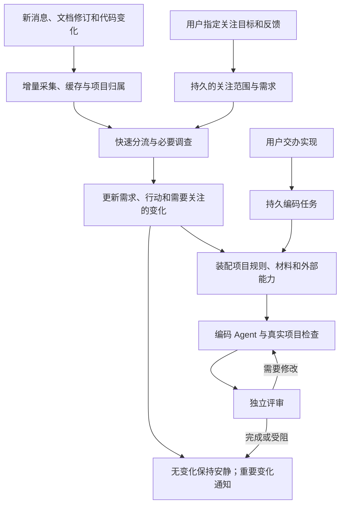

# 主助手怎样持续跟进并交办编码

更新：2026-10-06。本文是对现有实现的核对和接下来的改造方案，**不是已经接通的功能说明**。现有命令的实际用法见[需求跟进与编码](requirement-followup.md)。

用户已经确认默认策略：**自动跟进指定的需求；用户交办实现后，AI 自主编码、检查和独立评审。** 用户通过自然语言或页面调整目标，CLI 是 Agent 调用和排障的入口，不要求用户自己串起命令。自动编码不包含自动推送、合并或部署；这些沿用目标项目和用户的明确授权。

## 现在到底接到了哪里

| 能力 | 现在的实现 | 距离主助手自主执行还缺什么 |
| --- | --- | --- |
| 跟进消息和材料 | 订阅消息增量采集、缓存去重；后台可调查新材料的项目归属 | 不会根据所有群消息自动建立需求，也没有持续维护“我现在关心什么”的独立状态 |
| 维护需求 | 指定材料或项目后，持久队列随材料变化重新调查、写作、独立复核；结构化保存目标、验收和行动项 | 目前通过页面/CLI 配置。主助手没有建立、调整、暂停需求跟进的动作工具 |
| 跟进个人行动 | follow 后，已复核需求更新同步同一待办；保留人工修改，复用既有通知 | 不会把所有需求行动自动变为个人承诺；尚无完整的自然语言关注策略与反馈管理 |
| 实施和评审 | 独立 Git 副本、项目规则和 skills、代码工具、真实检查、新会话评审、有限回修、补丁应用 | start/resume 是前台 CLI；没有接到主助手的持久后台编码队列，服务重启不会自动续跑这些编码作业 |
| 多种编码 Agent | 通用 ACP 传输已经存在 | 编码执行器仍限定 Traex；配置中出现 codex-cli/claude-cli 枚举，不代表已有可用的编码适配 |
| 外部能力 | 原生角色 skills、研究 MCP、项目 skills 和登记命令可以使用 | 尚无统一的能力发现、登录状态、项目选择和任务装配机制；不能宣称已接通任意 Figma 或私有研发平台 |

关键接线可以在 `app.ts` 看到：需求发布通过 `onPublish` 调用 `RequirementTasks.sync`。但 `assistant/acp-model.ts` 目前装配的是调查和阅读工具，没有需求管理、编码派发或外部能力管理工具。因此，“CLI 已能做”和“主助手会自主调用”之间确实还缺一层。

## 用户应该怎样使用

一个贯穿消息、需求、设计与代码的例子：

1. **“帮我盯工单完成入口，只关心本期上线阻塞和需要我回答的事。”** 助手找到对应项目和材料，保存关注范围；只有项目无法区分时才请用户补充。后来收到需求文档、会议决定或群聊回复，继续维护同一需求。
2. **“批量完成不在本期；小李只负责接口，页面由我做。”** 助手记录这次纠正，调整范围和责任理解，说明受影响的行动。不能把它永久泛化为用户从不关心批量功能。
3. **“这部分交给你实现，用这个仓库和 Figma 节点。”** 主助手确认可用项目与能力，将需求版本、设计、代码基线和验收交给编码 Agent，立即返回任务和当前阶段，不让聊天请求一直等待到编码结束。
4. 编码 Agent 自主调查、修改和检查；独立评审读原始需求、实际差异、设计和检查结果。需要修改就带着具体问题回修。
5. 助手返回实现结果、可以查看的差异、实际检查和剩余问题。后续反馈继续进入同一任务；有新目标或验收变化时重新规划受影响部分。

其中第 1、2 步的自然语言管理以及第 3 步的后台派发是下一步要接的能力，不能用现有合成项目的 CLI 验证替代它们。

图中的需求更新提供编码上下文；装配与执行只有编码任务启动后才运行。**启动编码仍需要用户交办**，不能因为群消息出现“帮忙改一下”就自动运行。

## 关注点与反馈应该保存什么

仅修改文章的 goal 或给 prompt 追加一段话不足以支撑长期跟进。需要把下面三类内容分开，仍共用现有项目、需求和材料身份。

| 内容 | 例子 | 更新方式 |
| --- | --- | --- |
| 需求事实 | 本期范围、验收、决定、责任人、当前实现 | 从消息、文档和代码调查，保留来源与有效版本；冲突时记录待澄清问题 |
| 用户关注策略 | 只关心上线阻塞、忽略重复报警、明天检查反馈、暂时停止跟进 | 用户随时调整；助手可在既定目标内调整调查重点，但不得覆盖明确指定的优先级 |
| 人工反馈 | “这是提议，不是决定”“负责人理解错了”“这部分交给你实现” | 保存原话、时间、对象和适用范围；区分事实纠正、偏好和交办，不混成一段永久指令 |

关注策略至少需要保存所跟项目/需求、材料范围、关注与排除项、检查时机、通知偏好、暂停状态，以及当前采用的反馈版本。反馈可以针对一个行动、一个需求或整个项目；全局偏好需要用户明确表达。反馈结果应能在需求页看见并撤销。

用户改关注点时，既有跟进任务继续使用同一身份。普通偏好变更影响下一次调查和通知；实质验收变更使当前编码结果需要重新核对，并将变更交给执行任务。保留已经完成的修改与检查，不把旧评审结论直接套给新需求，也不无条件全部重做。

需求文章可以解释状态，但不承担全部机器状态。待办、关注设置、反馈和开发任务应分别持久保存，彼此关联，避免每次生成文章就重置用户的选择。

## 消息很多时怎样跟进

沿用当前采集游标、消息与附件缓存、项目归属和文章维护队列。以新增或变化的材料触发处理，短时间内同一需求的连续消息合并调查；没有变化就不重新生成整篇需求。

小决策模型适合给出候选项目、是否含需求变化、是否为阻塞/决策/行动、是否有新背景等建议。明确无关或完全重复的内容可以省略后续工作；含糊、相互矛盾和可能影响验收的内容由较强 Agent 补读。用户纠正优先于分类结果，小模型不直接改变负责人、截止时间或批准编码。

调查完成后，对比旧需求，按实际变化生成说明，例如“接口验收已完成，页面仍等设计确认”；不要每次都通知“知识已整理”。只有新阻塞、需要用户回答、重要计划变更、任务完成或执行失败进入通知。仍复用现有站内通知和已绑定机器人的 outbox；个人飞书身份继续只读，不借外部能力突破这一约束。

新需求可以在已关注范围内形成候选并告知用户，不需要每条消息都新建项目。关注范围之外的数据采集不由模型自行扩大。

## 编码 CLI 与外部能力是两层

### 复用各个 CLI 的 Agent 循环

omem 负责持久任务、需求与材料、工具范围、检查和结果回收。搜索代码、反复调用工具、修改与回修交给编码 CLI 的原生循环，不再实现第二套通用编码 Agent。

ACP 已定义用 `session/new` 传入工作目录与 MCP 服务；可选能力按协商结果使用。应扩展现有传输适配，而不是另造协议。参见 [ACP 会话规范](https://agentclientprotocol.com/protocol/v1/session-setup)。

| 提供方 | 复用入口 | 本仓库还要做的适配 |
| --- | --- | --- |
| Traex | 现有真实 ACP 编码流程 | 从当前执行器中抽出提供方专用参数、skills 装配和权限策略，保留已有可用路径 |
| Codex | [`@agentclientprotocol/codex-acp`](https://github.com/agentclientprotocol/codex-acp)，通过 Codex App Server 提供 ACP | 接启动、模型/思考强度发现、MCP、权限、进度与取消；核实安装版行为并实际编码验收 |
| Claude | [`@agentclientprotocol/claude-agent-acp`](https://github.com/agentclientprotocol/claude-agent-acp)，基于 Claude Agent SDK 的社区 ACP 适配器 | 做同样的会话与执行边界适配；不能把社区适配器说成 Claude CLI 原生 ACP 已经接通 |

编码和独立评审应分别选择 profile。动态检查提供方支持的模型、思考强度、工具和权限，不把 Traex 的参数传给其他 CLI。活动超时继续随真实模型/工具进展续期。只有提供方支持并验证过的会话恢复才使用原会话，否则以已保存任务、代码和问题启动新会话。

截至本次核对，只验证了 Traex；没有安装或实跑上述两个 ACP 适配器。

### 外部能力包负责补足项目上下文和操作

“插件”先做已有 skill、MCP 和 CLI 的组合，不做新的脚本语言或插件市场。一个能力包声明它能做什么、怎样检查可用状态、使用哪些 skill/MCP/CLI，以及适用项目和允许动作。普通工具结果和远端设计/文档内容仍是材料，不能成为授权来源。

能力使用流程：**列出可用能力 → 检查依赖与登录 → 根据任务读取相关 skill → 给本次会话装配工具 → 保存必要材料与执行结果。** 缺登录、仓库地址或节点信息时报告具体缺项，不把“没有工具”误判成“没有设计要求”。配置保存凭据引用或使用 CLI 现有登录态，不复制密钥进 prompt、技能包或仓库。

| 场景 | 应复用什么 | 融入 omem 的方式 |
| --- | --- | --- |
| Figma 设计 | [官方 Figma MCP](https://developers.figma.com/docs/figma-mcp-server/) 的设计上下文、节点、截图、变量和组件映射；配合项目已有 design/browser skill | 先读明确页面与节点，捕获任务所需的设计材料与版本信息；实现和独立评审读同一份输入，再用项目浏览器流程核对页面。截图下载成功不等于视觉验收通过 |
| 私有 Git | 通用 Git、现有 SSH/HTTPS 登录，必要时配合公司 CLI 的项目发现和权限检查 | 从远端地址和 ref 准备本地仓库，保存仓库身份和提交，交给现有独立副本流程。当前已支持本地 Git，不依赖 GitHub；远端获取、刷新及认证编排还需接入 |
| 私有研发平台 | 对应 CLI/MCP 与操作 skill | 按任务提供接口、IDL、Mock、环境等上下文；提交评审、部署等动作分别按用户授权和项目规则处理，不假设全部使用 gh |
| 可复用知识与约定 | 标准 [Agent Skills](https://agentskills.io/specification) 格式与项目已有规则 | 先展示技能名称和用途，需要时读正文及引用资源；把有关规则提供给对应角色，不将全部技能内容塞入每次调用 |

全局配置保存可用能力，项目选择常用能力，单个任务选择实际加载项。提供方适配负责原生 skills/MCP 的差异；业务逻辑不应反复判断 `traex`、`codex` 或 `claude` 字符串。能够使用第三方工具不代表 omem 自动获得该工具的写权限。

## 对现有代码的具体改造

下面都是计划改动；除核对现状外，本次没有实现这些接口。

| 接点 | 改造内容 | 复用现有能力 |
| --- | --- | --- |
| `packages/contracts/src/development.ts`、`knowledge/requirements.ts` | 增加独立的关注设置与反馈记录，关联项目、需求、行动和任务；需求事实保留原结构 | 已有稳定 criteria/actions、固定来源与 requirement handoff |
| `knowledge/api.ts`、`knowledge/page-worker.ts` | 抽出页面管理服务，让 API、CLI 和助手共用；正在调查时也能保存新反馈，下轮按新版本处理 | 已有持久任务、材料摘要、合并更新和失败保留旧文 |
| `assistant/acp-model.ts`、`assistant/research.ts` | 装配需求查询/管理、关注反馈、开发派发/状态、能力目录工具；操作返回实际任务与结果 | 现有 `ResearchTool` 与 MCP 装配入口，不让主助手拼 shell 串调用自己 |
| `assistant/runtime.ts` | 把当前用户交办、会话身份、研究模式和取消状态传给动作服务；回答基于实际回执 | 现有事项动作应用与取消保护；源材料不授予写权限 |
| `development/runner.ts`、`jobs/worker.ts` | 将前台执行器接为持久后台工作；入队立即返回，保存阶段、进度、问题和恢复位置 | 现有独立 Git 副本、真实检查、独立评审与回修；复用 job lease 和重启恢复机制 |
| `agents.ts`、`agent-runtime/gateway.ts`、`agent-runtime/bundles.ts` | 抽出提供方装配，编码/评审各自选择 profile；不再限制可执行文件名为 Traex | 现有 ACP 协议、能力发现、活动超时、输出合同与 trace |
| 配置与新增能力注册模块 | 登记 skill/MCP/CLI、检查可用状态、选择项目能力；给会话按需装配 | 使用标准格式与已登录工具；不另造平台账户体系 |
| `app.ts` 与现有通知应用层 | API 和主助手注入同一组服务；后台任务绑定发起会话、完成后通知；开发结果捕获成材料再回到需求 | `RequirementTasks`、MemoryService、既有通知 outbox；不把 ready 写成已上线 |

后台任务必须保存需求版本、采用的反馈、仓库提交、能力选择和发起者，不能只保存一段 prompt。编码排队/运行/需要补充/评审/可交付等阶段应可查询；进程中断、主动取消与模型静默超时分开处理。用户回来问“做到哪了”时读真实状态，不再启动一个重复任务。

## 交付顺序与验收

**先接主助手实际使用已有能力。** 用现有 Traex 路径打通自然语言建立关注、纠正范围、交办后台编码、查询进度和收到结果；同时接入最小能力目录，让缺失工具能被发现。暂时没有真实设计项目时，不给用户展示假装可用的 Figma 验收。

随后选择一个用户授权的私有仓库和一个具体设计节点，验证读取、准备项目、调用能力、实现和独立评审。再分别验收 Codex 与 Claude 提供方；它们与业务任务解耦，不需要为每种 CLI 复制需求、通知和工作流。

第一条可用流程的验收应是：

- 用户只说要跟进的事情，Agent 自己完成已具备信息的配置与工具调用；有歧义时问具体缺项。
- 两轮真实材料变化能更新同一需求；用户纠正范围后，下一轮不会继续按旧范围提醒。
- 用户交办后，聊天立即返回可追踪任务；服务重启不会丢失任务或重复创建编码副本。
- 编码与独立评审确实执行必要检查；结果回到主助手，能回答修改了什么、验证了什么、仍缺什么。
- 任务结果与通知按实际状态展示；没有材料变化时安静，缺工具时明确报告。

不以工具数量、schema 通过、协议 fixture 或生成一篇新指南作为上述流程已经交付的证明。
